# CulturePass — Business Process Management System (BPMS)

**Version 1.0 · August 2026** · Owner: CEO · Review: quarterly

This is the operating manual. It defines every core business process: who owns it, what triggers it, what systems execute it, what service level it must meet, how it is measured, what controls protect it, and what to do when it fails. Processes are mapped to the **actual** route and API surface of the running platform so that process design and product reality cannot drift apart.

---

## 0. How this BPMS is structured

### 0.1 Process architecture

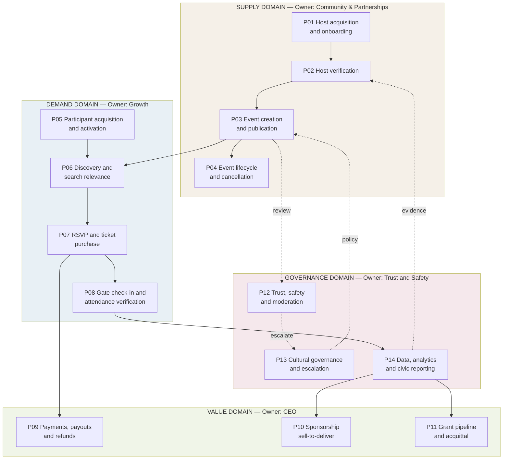

**The critical path is P01 → P02 → P03 → P06 → P07 → P08 → P14.** Everything else supports it. If any step in that chain is broken, the business does not function, and no other process compensates.

### 0.2 RACI convention

**R** Responsible (does the work) · **A** Accountable (single owner, answers for the outcome) · **C** Consulted · **I** Informed.
Exactly one A per process. If two people are accountable, nobody is.

### 0.3 Role codes

| Code | Role | FY27 holder |
|---|---|---|
| CEO | Founder & CEO | Bibin Jose |
| ENG | Senior Full-Stack Engineer | Hire #1 |
| COM | Community & Partnerships Lead | Hire #2 |
| GRO | Growth & Content Marketer | Hire #3 |
| TSO | Trust, Safety & Ops Coordinator | Hire #4 |
| DAT | Data & Impact Analyst | Hire #5 |
| CAC | Cultural Advisory Council | Convened Q2 FY27 |
| HOST | External — the organiser | — |
| PART | External — the participant | — |

In FY27 several codes resolve to the same two or three people. The codes still matter: they define what the role is accountable for when the team grows, and they prevent the classic startup failure where a process silently has no owner because "we all do it".

### 0.4 Process maturity model

Every process is scored 1–5. Target maturity is stated per process; anything below target by two levels is a standing agenda item at the monthly business review.

| Level | Name | Meaning |
|---|---|---|
| 1 | Ad hoc | Done differently each time, in someone's head |
| 2 | Defined | Written down, followed inconsistently |
| 3 | Measured | Followed consistently, instrumented, SLA tracked |
| 4 | Controlled | Deviations trigger alerts; controls tested |
| 5 | Optimised | Continuously improved from its own data |

---

# SUPPLY DOMAIN

## P01 — Host acquisition and onboarding

| Field | Value |
|---|---|
| **Accountable** | COM |
| **Trigger** | Inbound signup, outbound field outreach, partner referral, or awards nomination |
| **Inputs** | Target suburb list, partner MoU pipeline, host prospect list |
| **Systems** | `/communities/create`, `/businesses/create`, `POST /api/communities`, `POST /api/users`, CRM |
| **Cycle time target** | Contact → first published event ≤ 14 days |
| **Maturity: current 2 · target 4** |

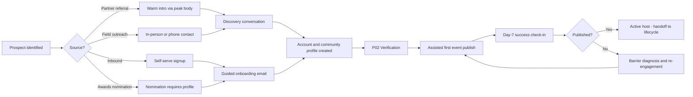

**RACI:** COM **A/R** · GRO R (inbound funnel, content) · CEO C (partner-level relationships) · TSO I · DAT R (attribution, cohort tagging)

**SLAs**
| Step | SLA |
|---|---|
| Inbound signup → first human contact | 48 hours |
| Verification submitted → decision | 3 business days |
| Signup → first published event (median) | 72 hours |
| Day-7 success check-in completed | 100% of new hosts |

**KPIs:** hosts onboarded/week · signup→publish conversion rate · median time to first publish · CAC by source · % hosts from partner channels (target ≥40%)

**Controls**
- Every host is tagged with acquisition source at creation. Attribution cannot be reconstructed later — this is enforced at the API layer, not by convention.
- No prospect is approached in a community where a peak-body relationship is in progress without COM sign-off. Approaching the wrong person can close a whole network.
- Weekly review against per-suburb density targets, not aggregate totals.

**Failure modes**
| Failure | Detection | Recovery |
|---|---|---|
| Host signs up, never publishes | Day-7 check-in | Assisted publish session; if the barrier is product, it becomes a P0 product ticket |
| Onboarding stalls at verification | Verification backlog age | Escalate to TSO; provisional publish rights for free events only |
| Suburb below density target | Weekly density review | Reallocate field time; consider council/library programming to establish a floor |
| Community relationship damaged by wrong-contact approach | Partner feedback | CEO-led repair; CAC consulted if cultural authority is disputed |

---

## P02 — Host verification

| Field | Value |
|---|---|
| **Accountable** | TSO |
| **Trigger** | Host requests verification, or attempts to publish a paid event |
| **Inputs** | Identity document, ABN/incorporation evidence or two community references |
| **Systems** | `/admin` moderation queue, `POST /api/admin/...`, Cognito, audit log |
| **Cycle time target** | ≤ 3 business days |
| **Maturity: current 2 · target 4** |

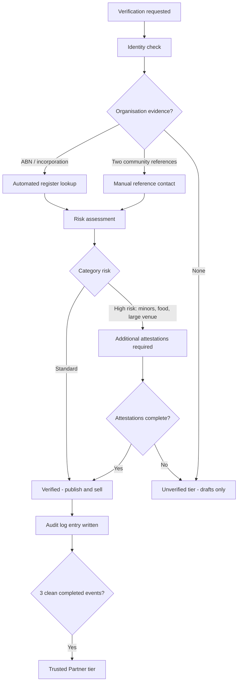

**Tiers and rights**
| Tier | Can draft | Can publish free | Can sell tickets | Can receive payouts | Promotional eligibility |
|---|---|---|---|---|---|
| Unverified | ✅ | ❌ | ❌ | ❌ | ❌ |
| Verified | ✅ | ✅ | ✅ | ✅ | ❌ |
| Trusted Partner | ✅ | ✅ | ✅ | ✅ (accelerated) | ✅ |

**RACI:** TSO **A/R** · ENG R (tooling, register integration) · CEO C (edge cases, appeals) · CAC C (First Nations and cultural-authority cases) · COM I

**SLAs:** decision ≤3 business days · high-risk category review ≤5 business days · appeal review ≤5 business days

**KPIs:** verification backlog age (target <2 days median) · approval rate · % of published events by verified hosts (target 100%) · verification-related host drop-off

**Controls**
- Every decision writes an immutable audit log entry with reviewer identity and reason. No exceptions, including CEO overrides.
- Paid ticketing is technically gated on verified status at the API layer, not in the UI. UI-only gating is not a control.
- First Nations cultural authority is never assessed by staff. It routes to CAC (see P13).
- Two-person review for any rejection, to prevent single-reviewer bias against unfamiliar organisational forms — a community association without an ABN is normal, not suspicious.

**Failure modes**
| Failure | Detection | Recovery |
|---|---|---|
| Backlog blocks onboarding | Backlog age alert >3 days | Provisional free-publish rights; surge review capacity |
| Legitimate community org rejected for lacking corporate paperwork | Appeal volume; COM escalation | Reference-based pathway; retrain reviewer; the reference pathway exists precisely for this |
| Fraudulent host verified | Chargebacks, reports, no-show event | Immediate suspension, payout freeze, refunds, incident review |

---

## P03 — Event creation and publication

| Field | Value |
|---|---|
| **Accountable** | TSO (gate) / HOST (content) |
| **Trigger** | Host initiates event creation |
| **Systems** | `/create`, `POST /api/events`, `/admin` queue, `/events/:id` |
| **Cycle time target** | Publish request → live ≤ 4 hours (new host) / immediate (established) |
| **Maturity: current 3 · target 4** |

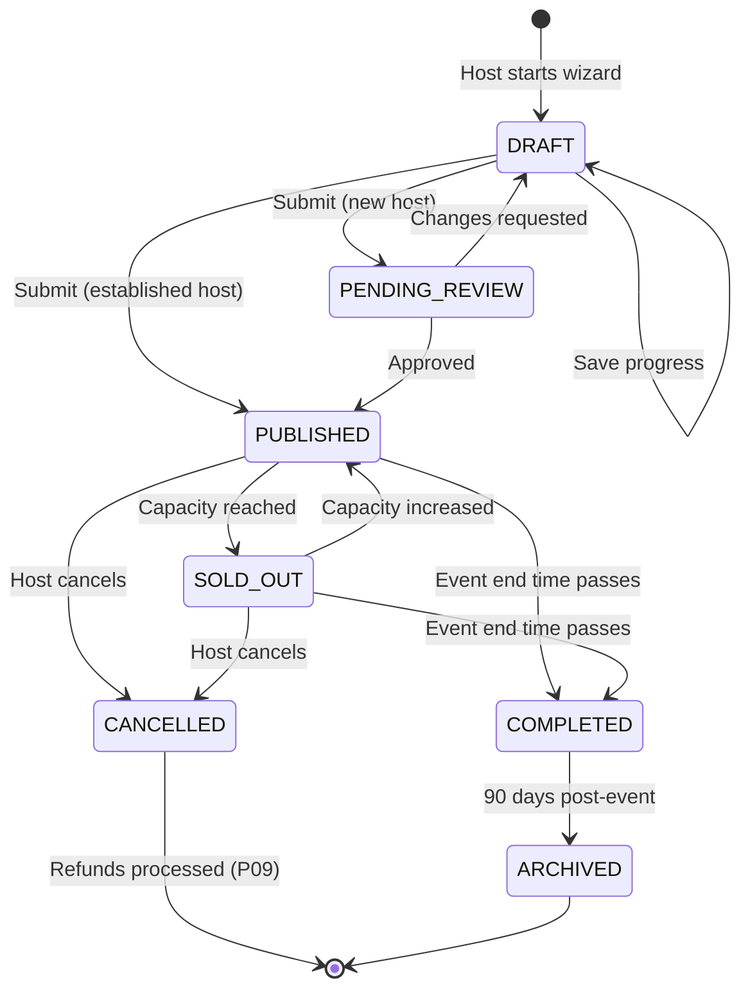

**Publish quality gate — every event must have:**
| Requirement | Enforced |
|---|---|
| Title, description, start time, venue, address, city | Hard block |
| Cultural community / category tag | Hard block — this is the taxonomy the whole product depends on |
| Price or explicit "free" | Hard block |
| Image (1:1 preferred) | Soft warning |
| Accessibility information | Soft warning, hard block from FY27 Q3 |
| Child-safety attestation where minors involved | Hard block, conditional |
| Insurance attestation for high-risk categories | Hard block, conditional |

**RACI:** TSO **A** · HOST R (content) · TSO R (review) · ENG R (wizard, validation, state machine) · CAC C (taxonomy definitions) · DAT I

**SLAs:** new-host review ≤4 business hours · changes-requested turnaround communicated within 4 hours · established-host publish immediate with post-hoc sampling at ≥10%

**KPIs:** wizard completion rate (target ≥75%) · median time-to-publish · review queue age · post-publish edit rate (a proxy for wizard quality) · % events with complete accessibility info

**Controls**
- New hosts always go through `PENDING_REVIEW` for their first event. No exceptions.
- Established-host publishing is sampled at ≥10% post-hoc. Trust with verification, not trust alone.
- State transitions are enforced server-side. A cancelled event cannot silently return to published.
- Taxonomy tags are drawn from a controlled vocabulary governed by CAC (P13), never free text. Free-text cultural tags destroy the dataset within one quarter.

**Failure modes**
| Failure | Detection | Recovery |
|---|---|---|
| Wizard abandonment | Completion-rate drop | Session analysis of the abandoned step; wizard becomes a P0 |
| Review queue blocks a time-sensitive event | Queue age + host escalation | Priority lane for events within 7 days of start |
| Harmful or misrepresenting content published | Report from P12 | Immediate unpublish, review, host consequence per policy |
| Duplicate events from the same host | Similarity detection | Merge prompt at creation time |

---

## P04 — Event lifecycle and cancellation

| Field | Value |
|---|---|
| **Accountable** | HOST, with TSO oversight |
| **Trigger** | Time-based transition, capacity change, or host cancellation |
| **Systems** | `/events/:id/manage/*`, SQS notification queue, SES, `POST /api/events/:id` |
| **Maturity: current 3 · target 4** |

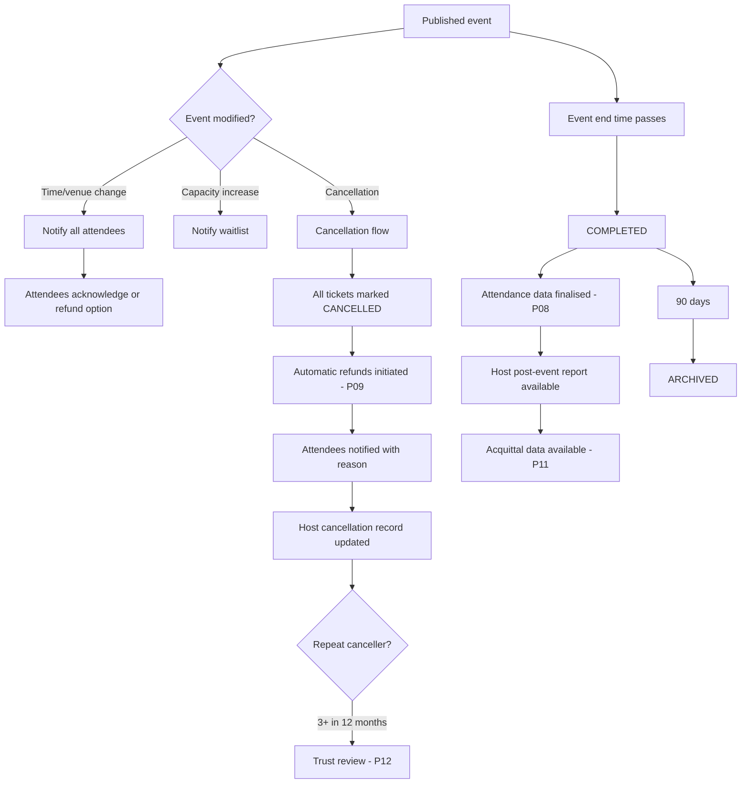

**RACI:** HOST **A/R** · TSO A (policy compliance) · ENG R (notification pipeline) · DAT R (attendance finalisation)

**SLAs:** cancellation → attendee notification ≤1 hour · cancellation → refund initiated ≤24 hours · material change (time/venue) → notification ≤1 hour · post-event report available ≤24 hours after end

**KPIs:** cancellation rate (target <4% of published events) · % cancellations with refunds completed within SLA · repeat-canceller count · post-event report open rate

**Controls**
- Cancellation cannot complete without a stated reason recorded.
- Refunds for host-initiated cancellation are automatic and non-discretionary. A host cannot cancel and keep the money.
- Three or more cancellations in 12 months triggers a trust review, not an automatic penalty — some cancellations are genuinely unavoidable.

**Failure modes**
| Failure | Detection | Recovery |
|---|---|---|
| Attendees not notified of change | Notification delivery monitoring | Manual send; SQS dead-letter queue alarm investigated |
| Cancelled event still shows as live | State audit job | Server-side state enforcement; reconciliation job daily |
| Host cancels after collecting funds and disputes refund | Refund exception report | Payout hold; funds recovered from held balance; escalate per terms |

---

# DEMAND DOMAIN

## P05 — Participant acquisition and activation

| Field | Value |
|---|---|
| **Accountable** | GRO |
| **Trigger** | Campaign, host share, partner channel, organic search, or awards vote |
| **Systems** | `/onboarding`, `POST /api/users`, `/api/analytics`, SES digest |
| **Activation definition** | Registered + followed ≥1 community + RSVP'd or ticketed ≥1 event within 14 days |
| **Maturity: current 2 · target 4** |

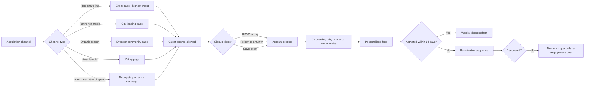

**RACI:** GRO **A/R** · COM R (host-share mechanic, partner channels) · ENG R (onboarding, guest mode, attribution) · DAT R (attribution model, cohort reporting) · CEO I

**SLAs:** onboarding completable in ≤90 seconds · weekly digest delivered Thursday 17:00 local · reactivation sequence begins day 15

**KPIs:** registrations/week by channel · activation rate within 14 days (target ≥45%) · day-7 and day-30 retention · **share of new participants from host-referred and partner channels (target ≥40%)** · blended participant CAC (target ≤A$4.20 FY27) · paid share of marketing spend (hard cap 25%)

**Controls**
- Attribution is captured at account creation and is immutable. Retrofitting attribution is impossible and every company that tries regrets it.
- Guest browsing is always permitted. Forcing signup before value is delivered kills the top of the funnel in a discovery product.
- Paid spend above 25% of the marketing budget requires CEO approval, because it signals the community-led growth thesis is failing (risk R12) and that is a strategy conversation, not a budget one.

**Failure modes**
| Failure | Detection | Recovery |
|---|---|---|
| High registration, low activation | Activation-rate drop | Feed density is the usual cause → escalate to P01/P06, not to onboarding UX |
| Host-referred share below 40% | Weekly channel mix | Improve host share tooling; this is a product gap, not a marketing one |
| CAC rising | Weekly CAC by channel | Pause the worst channel; re-check the paid cap |

---

## P06 — Discovery and search relevance

| Field | Value |
|---|---|
| **Accountable** | ENG, with GRO as editorial owner |
| **Trigger** | Every participant session |
| **Systems** | `/`, `/discover`, `/calendar`, `/directory`, `GET /api/events` (forYou, nearby, popular, following), NL query parser, `/api/places` |
| **Maturity: current 3 · target 5** |

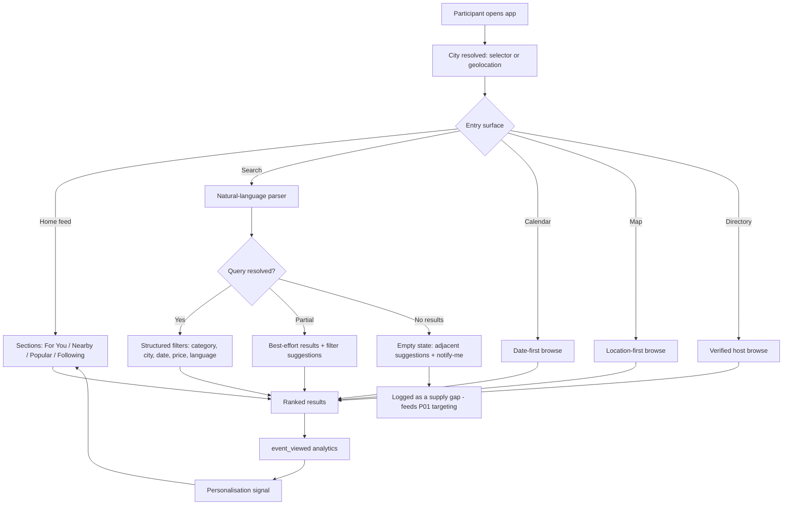

**Ranking inputs (organic only):** proximity · time to event · followed-community match · declared interest match · popularity velocity · host verification tier · content completeness.

**Sponsored placement is a separate, labelled slot. It does not enter the organic ranking function.** This is enforced in code, and it is the editorial firewall from the sponsor contracts.

**RACI:** ENG **A/R** · GRO R (editorial curation, collections) · DAT R (relevance measurement) · CAC C (taxonomy and language mappings) · CEO I

**SLAs:** search response p95 <400ms · feed load p95 <1.5s on 4G mobile · empty search rate <15%

**KPIs:** **empty search rate** (the single most important supply-health signal) · search→view rate · view→RSVP rate · feed CTR by section · zero-result queries by suburb and by language (routed to P01 as an acquisition target list)

**Controls**
- Zero-result queries are logged with location and language and delivered weekly to COM as a prioritised supply-gap list. A search nobody could satisfy is the highest-quality demand signal we get, and throwing it away is the most common waste in discovery products.
- Sponsored slots are visually labelled and capped at 1 in 8 feed positions.
- OpenSearch migration is triggered at 15,000 published events — the repository abstraction exists specifically so this is a two-week change.

**Failure modes**
| Failure | Detection | Recovery |
|---|---|---|
| Empty search rate rising | Weekly metric | Supply problem, not a search problem → P01 targeting |
| NL parser mis-resolving language queries | Zero-result queries containing language names | Extend language mapping table with CAC input |
| Relevance degrades with volume | View→RSVP rate decline | Trigger OpenSearch migration; re-tune ranking weights |

---

## P07 — RSVP and ticket purchase (order to pass)

| Field | Value |
|---|---|
| **Accountable** | ENG |
| **Trigger** | Participant taps RSVP or Buy ticket |
| **Systems** | `/events/:id`, `/checkout-mock` → Stripe, `POST /api/tickets`, `/tickets/:id`, SES, `add-to-calendar` |
| **Maturity: current 3 · target 5** |

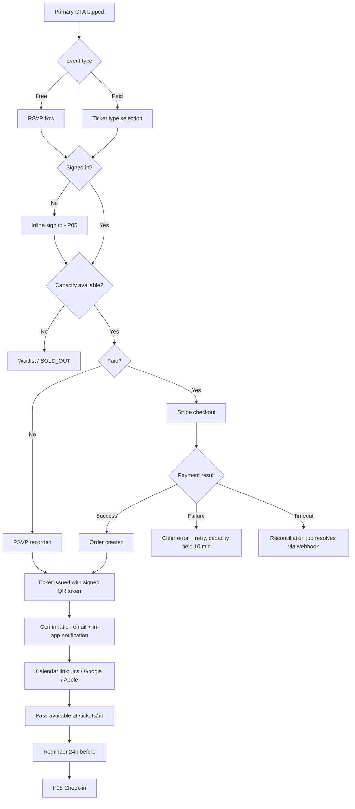

**RACI:** ENG **A/R** · TSO C (fraud rules) · DAT R (funnel instrumentation) · CEO A (fee policy) · HOST I

**SLAs:** checkout p95 <3s end to end · pass available immediately on success · confirmation email ≤2 min · reminder at T-24h · payment failure recovery attempted within 10 min (capacity held)

**KPIs:** view→RSVP conversion · view→purchase conversion · checkout abandonment rate · payment failure rate (target <2%) · **fee transparency complaints (target 0)** · pass-open rate before event

**Controls**
- Capacity is decremented atomically. Overselling a 60-seat hall is a real-world failure, not a data inconsistency.
- All fees are disclosed before payment is authorised — an Australian Consumer Law requirement and a trust requirement.
- QR tokens are server-signed. The client never generates a valid pass.
- Free RSVP never touches a payment path, so it cannot accrue a fee. The "free stays free" commitment is architectural, not a pricing decision someone could quietly reverse.

**Failure modes**
| Failure | Detection | Recovery |
|---|---|---|
| Payment succeeds, ticket not issued | Stripe webhook vs order reconciliation (hourly) | Auto-issue on reconciliation; alert if >0 unresolved after 1 hour |
| Oversell | Capacity audit | Atomic decrement; honour all tickets and compensate host; treat as a P0 incident |
| Checkout abandonment spike | Funnel monitoring | Session replay of the failing step; usually price surprise or auth friction |

---

## P08 — Gate check-in and attendance verification

| Field | Value |
|---|---|
| **Accountable** | HOST at the door, ENG for the system |
| **Trigger** | Attendee arrives at the event |
| **Systems** | `/events/:id/check-in`, `/tickets/:id/check-in`, `POST /api/tickets/:id/check-in` |
| **Maturity: current 3 · target 5** |

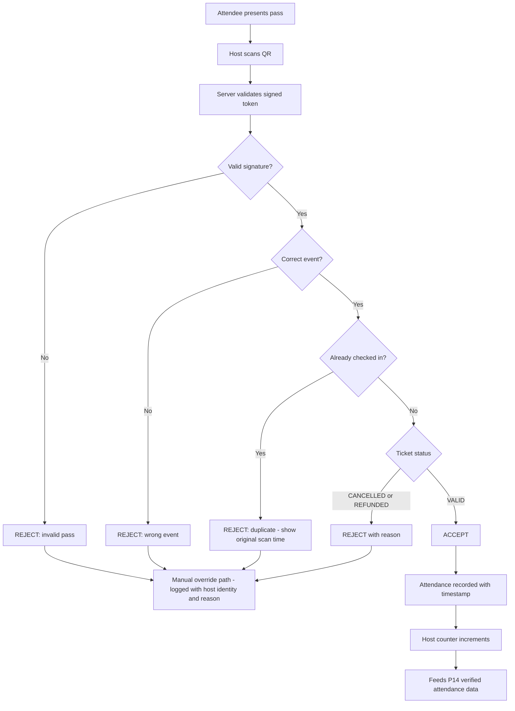

**Why this process carries disproportionate weight:** verified attendance is the North Star metric, the basis of the civic product, and the evidence in every grant acquittal. If check-in integrity is weak, the entire measurement thesis collapses — and the civic revenue line with it. **This is the most important control point in the business.**

**RACI:** ENG **A** · HOST R (execution at the door) · TSO R (override audit) · DAT R (data quality) · CEO I

**SLAs:** scan-to-decision <1s · offline-capable scanning with sync on reconnect (FY27 Q3 — church halls and community centres frequently have no signal) · attendance data finalised ≤24h post-event

**KPIs:** **check-in rate on paid tickets (gate: ≥85%)** · check-in rate on free RSVPs (target ≥55%) · rejection rate by reason · manual override rate (target <3%) · scan latency p95

**Controls**
- All four rejection conditions are enforced server-side. A client-side check is not a control.
- Every manual override is logged with host identity, reason and timestamp. Override rate is reported monthly — a host with a high override rate is either struggling with the tool or bypassing it, and both need attention.
- Attendance figures used in civic reporting distinguish verified check-ins from estimated attendance, always, with the estimation method stated.

**Failure modes**
| Failure | Detection | Recovery |
|---|---|---|
| No connectivity at venue | Host reports; scan failure rate | Offline mode with local queue and signed-token validation; sync on reconnect |
| Host does not scan at all | Check-in rate zero for a completed event | Host outreach; the acquittal report is the incentive — no scan, no report |
| Attendee cannot produce a pass | Support volume | Name-based lookup on the guest list, logged as an override |
| Fraudulent duplicate passes | Duplicate rejection rate | Signed tokens make this near-impossible; investigate any cluster |

---

# VALUE DOMAIN

## P09 — Payments, payouts and refunds

| Field | Value |
|---|---|
| **Accountable** | CEO (financial control), ENG (execution) |
| **Trigger** | Ticket sale, refund request, event completion, or cancellation |
| **Systems** | Stripe + Stripe Connect, `POST /api/tickets`, reconciliation jobs, accounting system |
| **Maturity: current 1 · target 4 — this is the least mature critical process and a pre-launch blocker** |

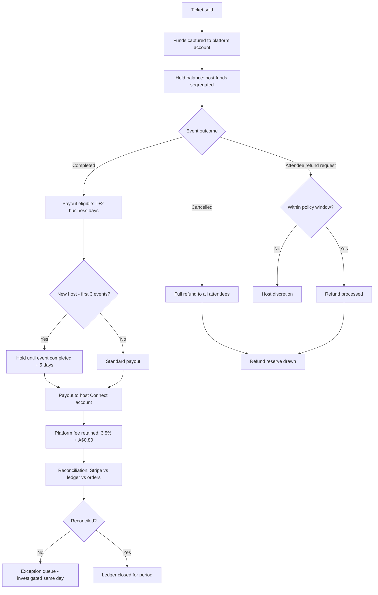

**RACI:** CEO **A** · ENG R (integration, reconciliation) · TSO R (fraud review) · DAT C · external accountant R (period close)

**SLAs:** refund initiated ≤24h of approval · payout T+2 after event completion (T+5+ for new hosts) · daily reconciliation with same-day exception resolution · chargeback response within Stripe deadline

**KPIs:** payout SLA compliance · refund rate (target <3% of GMV) · chargeback rate (target <0.4%) · **unreconciled exceptions at day close (target 0)** · fraud loss as % of GMV (target <0.1%)

**Controls — these are the ones that keep the company out of regulatory trouble**
- **Held ticket funds are segregated and sit under a trust-accounting treatment. The float is never used as working capital.** This must be in place before production payments launch. Not negotiable, not deferrable.
- A refund reserve is held against GMV.
- New-host payout holds until the event completes, so a host cannot collect funds for an event that never happens.
- Daily three-way reconciliation: Stripe settlement, internal ledger, order records. Any variance is investigated the same day.
- Segregation of duties: the person who can initiate a payout cannot approve a refund exception. In FY27 with a small team this means CEO approval on any manual financial action, logged.

**Failure modes**
| Failure | Detection | Recovery |
|---|---|---|
| Payment captured, no ticket | Hourly reconciliation | Auto-issue or auto-refund; alert if unresolved >1h |
| Host absconds with pre-sale funds | Event not completed, attendee reports | Payout hold catches this for new hosts; recover from held balance; refund attendees from reserve |
| Chargeback wave | Chargeback-rate alert | Stripe Radar tuning, host review, evidence submission process |
| Reconciliation variance | Daily close | Same-day exception queue; unresolved variance escalates to CEO within 24h |

---

## P10 — Sponsorship sell-to-deliver

| Field | Value |
|---|---|
| **Accountable** | CEO (FY27), Sponsorship Lead (FY28+) |
| **Trigger** | Outbound outreach, inbound enquiry, or renewal window |
| **Systems** | CRM, `/api/sponsors`, sponsor placement inventory, `/admin`, DAT reporting |
| **Cycle time** | 8–16 weeks enterprise · 2–4 weeks local |
| **Maturity: current 1 · target 3** |

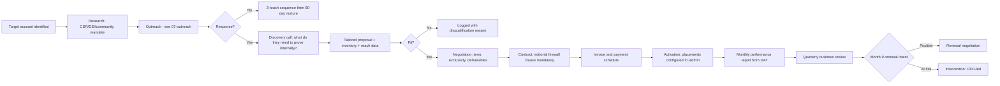

**RACI:** CEO **A/R** (FY27) · DAT R (reach and performance reporting) · GRO R (creative and activation) · TSO C (brand-safety review) · CAC C (any activation using cultural imagery) · ENG R (placement configuration)

**SLAs:** inbound enquiry response ≤24h · proposal within 5 business days of discovery call · monthly performance report by the 5th · QBR within 10 days of quarter end

**KPIs:** pipeline coverage ratio (target ≥3× of remaining target) · win rate · average contract value · **no single sponsor >15% of platform revenue** · renewal rate (target ≥70%) · time-to-activation post-signature

**Controls**
- **Editorial firewall clause in every contract:** placement is labelled, does not influence organic ranking, and "For You" is not purchasable. Any prospect who requires otherwise is disqualified, and the reason is logged.
- Any activation using cultural imagery requires a partnering community host and CAC review. No exceptions for large contracts — this is exactly where the pressure comes from and exactly where the trust breaks.
- Reach and audience-composition claims to sponsors come from DAT's verified data only. Never from estimates, and never from the founder's optimism in a room.
- Category exclusivity is tracked in a single register to prevent double-selling.

**Failure modes**
| Failure | Detection | Recovery |
|---|---|---|
| Pipeline coverage below 3× | Monthly pipeline review | Outbound surge; revise the FY revenue forecast honestly rather than hoping |
| Sponsor demands ranking influence | Negotiation | Disqualify. Documented as policy so it is not re-litigated per deal. |
| Delivered reach below contracted | Monthly report | Proactive disclosure to sponsor plus make-good inventory. Disclose before they discover it. |
| Concentration breach | Revenue-mix monitoring | Cap the deal or diversify before signing |

---

## P11 — Grant pipeline and acquittal

| Field | Value |
|---|---|
| **Accountable** | CEO (applications), DAT (evidence and acquittal) |
| **Trigger** | Grant round opens, or a funded project reaches a reporting milestone |
| **Systems** | Grant tracker, DAT reporting pipeline, acquittal report generator, `/api/analytics` |
| **Maturity: current 1 · target 3** |

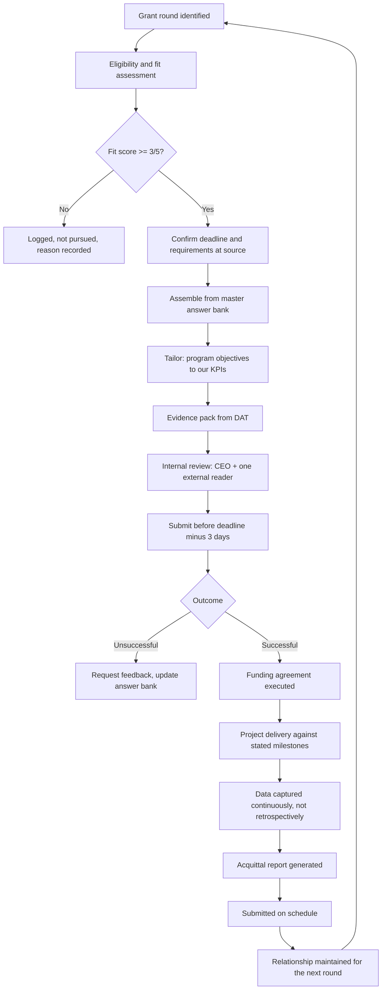

**RACI:** CEO **A/R** (applications, relationships) · DAT R (evidence, KPI reporting, acquittal generation) · COM C (community partner letters of support) · CAC C (cultural claims and First Nations components) · external grant writer R (as needed for large submissions)

**SLAs:** round identified → fit assessment ≤5 days · submission ≥3 days before deadline (never on the deadline) · acquittal submitted on or before the due date, 100% compliance · milestone data captured continuously

**KPIs:** applications submitted per quarter · win rate (benchmark 20–30%) · grant income secured vs target · **acquittal on-time rate (target 100%)** · pipeline coverage (target 3× of target income)

**Controls**
- **Acquittal data is captured continuously through the platform, never reconstructed at reporting time.** This is the single biggest advantage we have over every other applicant, and it is also what we sell to hosts. Losing it by reconstructing numbers at deadline would be self-defeating.
- No claim in any application that DAT cannot evidence. A grant acquittal that cannot be substantiated ends the relationship with that funder permanently and is reportable.
- Every deadline is verified at the funder's own source before work begins. Program dates change.
- A late acquittal is treated as a P0 incident. It costs future eligibility across a whole funding body.

**Failure modes**
| Failure | Detection | Recovery |
|---|---|---|
| Round missed | Calendar review | Rolling 12-month deadline calendar maintained by CEO; annual rounds mean a miss costs a year |
| Committed milestone not achievable | Monthly project review | Proactive variation request to the funder. Always before, never after. |
| Acquittal evidence not captured | Milestone data review | Fix at the platform level; the acquittal generator is a product feature for exactly this reason |
| Over-claiming in an application | Internal review by external reader | Second reader on every submission is the control |

---

# GOVERNANCE DOMAIN

## P12 — Trust, safety and moderation

| Field | Value |
|---|---|
| **Accountable** | TSO |
| **Trigger** | User report, automated flag, post-publish sample, or proactive review |
| **Systems** | `/admin` moderation queue, report submission on any profile, audit log, `POST /api/admin/...` |
| **Maturity: current 3 · target 4** |

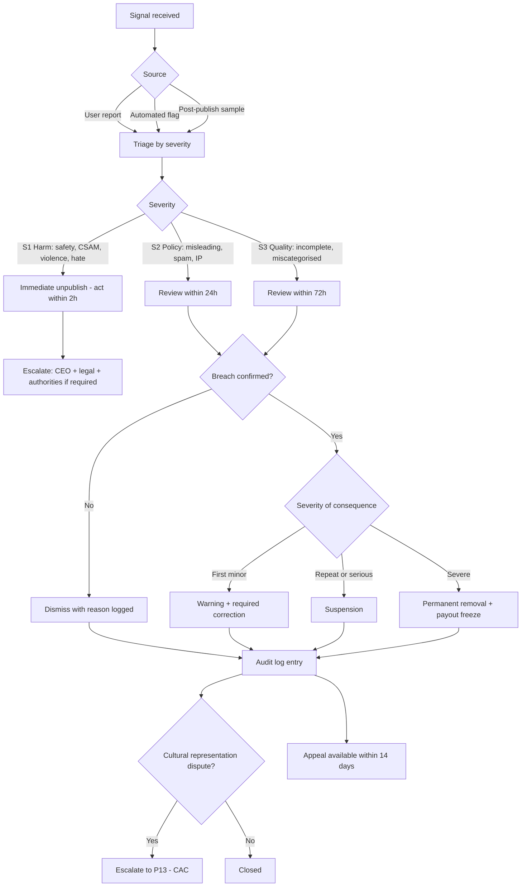

**RACI:** TSO **A/R** · CEO C (S1 and legal) · CAC A (cultural representation decisions — the company does not decide these) · ENG R (tooling, automated flags) · DAT I

**SLAs:** S1 action ≤2 hours (24/7 on-call) · S2 review ≤24 hours · S3 review ≤72 hours · appeal decision ≤5 business days · 90% of all reports triaged within 24 hours

**KPIs:** reports received/week · median time to resolution by severity · SLA compliance by severity · upheld rate · appeal overturn rate (a high rate means first-line decisions are wrong) · repeat-offender count

**Controls**
- Every decision writes an immutable audit log entry: reviewer, reason, severity, outcome. Including dismissals — dismissals are decisions.
- Appeals are reviewed by someone other than the original decision-maker.
- S1 has a named on-call owner at all times. "We'll see it Monday" is not an S1 process.
- Cultural representation disputes are **never** resolved by staff. They route to CAC (P13). Staff adjudicating cultural authority is how platforms destroy their legitimacy in this category.

**Failure modes**
| Failure | Detection | Recovery |
|---|---|---|
| S1 missed outside hours | On-call audit | 24/7 rotation with escalation path; a missed S1 is an incident review regardless of outcome |
| Queue backlog | Queue age alert | Surge capacity; temporarily raise the publish-review threshold |
| Inconsistent decisions | Appeal overturn rate | Published decision guidelines; calibration review monthly |
| Reporting weaponised against a community | Report clustering by target | Pattern detection; CAC consultation; reporter consequences |

---

## P13 — Cultural governance and representation escalation

| Field | Value |
|---|---|
| **Accountable** | Cultural Advisory Council (CAC), convened by CEO |
| **Trigger** | Representation dispute, taxonomy change request, First Nations content question, awards judging, or sponsor activation using cultural material |
| **Systems** | CAC register, taxonomy vocabulary, published escalation policy |
| **Maturity: current 1 · target 3 — CAC not yet convened; scheduled Q2 FY27** |

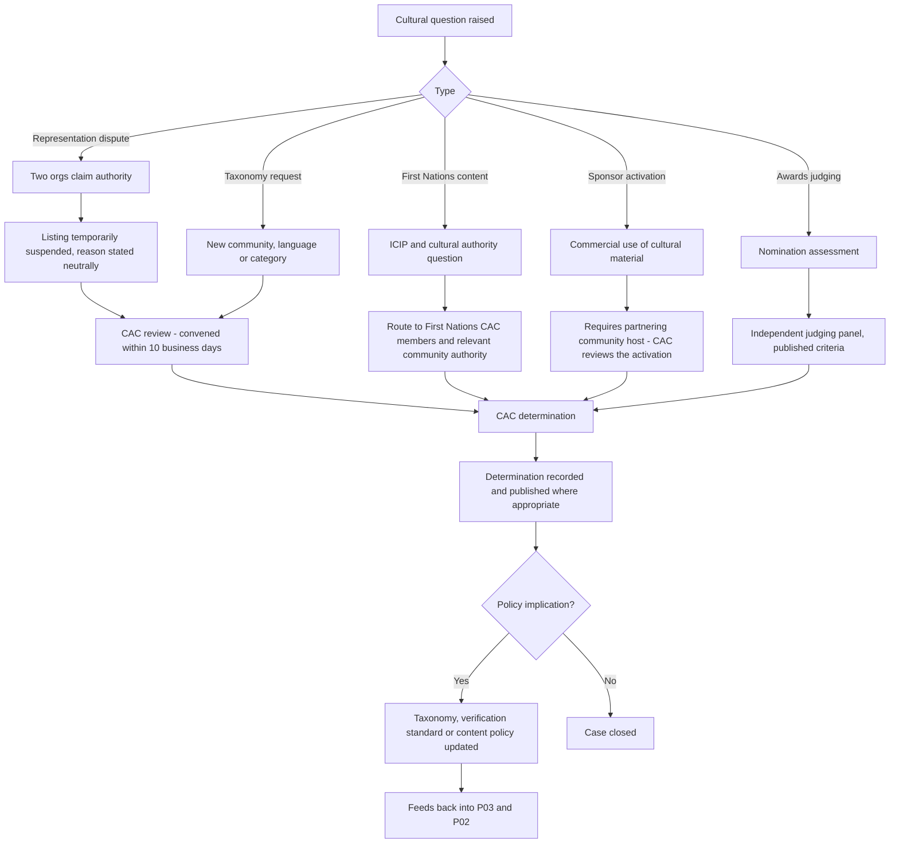

**Council composition (6–9 members, paid, quarterly):** First Nations representation (≥2) · major diaspora community representation (≥3, rotating) · arts practice (≥1) · community-sector governance (≥1).

**Council authority — real, not advisory-in-name:**
| Decision | Authority |
|---|---|
| Cultural representation disputes | **CAC decides. Binding.** |
| Cultural taxonomy and language vocabulary | **CAC decides.** |
| First Nations content and data protocols | **First Nations members decide.** Binding. |
| Verification standards for cultural authority | CAC decides |
| Culture Passion Awards judging criteria and panel | CAC approves |
| Sponsor activations using cultural material | CAC veto right |
| Commercial strategy, pricing, product roadmap | Consulted, not deciding |

**RACI:** CAC **A/R** (cultural determinations) · CEO R (convening, resourcing, implementing) · TSO R (case preparation) · COM C · ENG R (implementing taxonomy and policy changes)

**SLAs:** urgent dispute → CAC convened ≤10 business days · determination published ≤5 days after decision · quarterly scheduled meeting held within the quarter, always

**KPIs:** cases raised and resolved · median time to determination · **upheld cultural-representation complaints against the platform (target 0)** · CAC meeting attendance · community partner NPS

**Controls**
- **Members are paid.** An unpaid advisory council of community representatives is extraction wearing a governance costume, and it will be read that way.
- Conflict-of-interest declarations are published for awards judging.
- Determinations are recorded and, where appropriate, published — so the process is visible and precedent accumulates.
- The company cannot overrule a binding CAC determination. If it ever did, the council's existence would be theatre and the legitimacy it protects would be gone.

**Failure modes**
| Failure | Detection | Recovery |
|---|---|---|
| CAC not convened when needed | Case age | Standing quarterly plus on-call convening; the 10-day SLA is the commitment |
| Council composition unrepresentative | Community feedback | Rotating membership; annual composition review |
| Dispute escalates publicly before determination | Media or social monitoring | Neutral holding statement; do not pre-empt the CAC; never defend the company at the community's expense |
| Commercial pressure to overrule | CEO judgement | Written policy that CAC determinations are binding, agreed at board level before the pressure arrives |

---

## P14 — Data, analytics and civic reporting

| Field | Value |
|---|---|
| **Accountable** | DAT |
| **Trigger** | Continuous ingestion; scheduled reporting cycles; civic licence deliverables |
| **Systems** | `/api/analytics`, first-party analytics module, `AnalyticsEventName` taxonomy, `/admin` KPIs, civic dashboard, acquittal generator |
| **Maturity: current 2 · target 5 — this is the process that becomes the company's most valuable asset** |

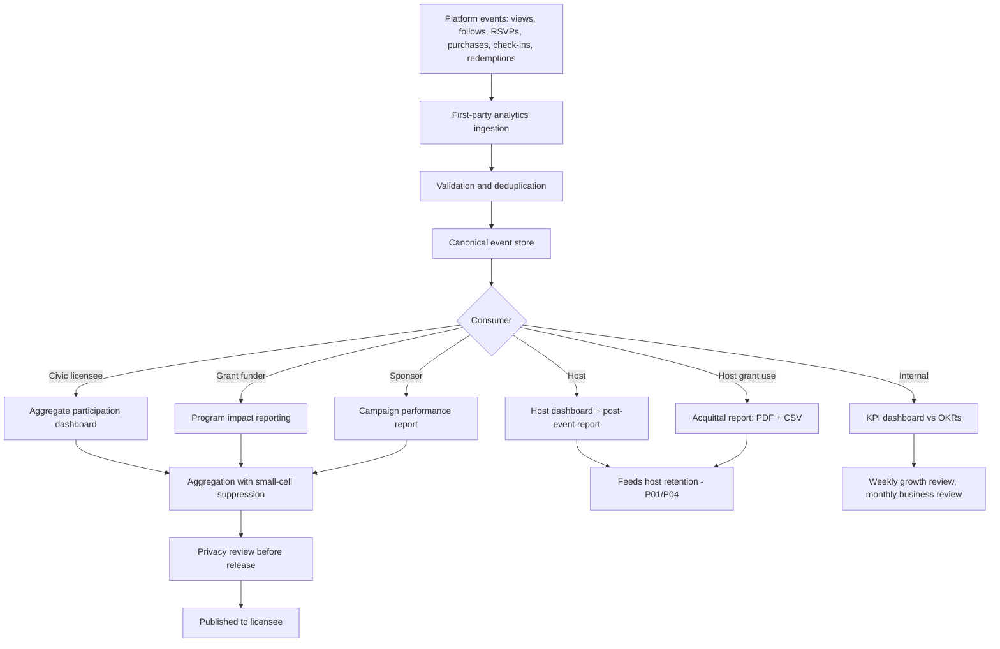

**The four civic metrics — what the dashboard actually answers:**
| Metric | Definition | Why the buyer needs it |
|---|---|---|
| Community engagement | Verified attendances segmented by cultural community | Answers "who participated" with evidence |
| Economic impact | Gross revenue generated for small and non-profit hosts | Answers "did our funding produce economic activity" |
| Cultural representation | Count of distinct cultural, linguistic and First Nations communities active | Answers "who are we under-serving" |
| Geographic dispersal | Attendance by suburb, and share outside the CBD | Answers "did activity move beyond the centre" |

**RACI:** DAT **A/R** · ENG R (pipeline, instrumentation) · CEO C (civic product definition) · TSO C (privacy review) · CAC C (First Nations data protocols) · external privacy reviewer C

**SLAs:** host post-event report ≤24h after event · acquittal report generated on demand ≤5 min · civic dashboard refreshed daily · sponsor report by the 5th of the month · internal KPI dashboard live continuously

**KPIs:** data completeness (% of completed events with finalised attendance) · **check-in rate as the data-trust proxy (≥85% paid)** · acquittal reports generated · civic dashboard usage by licensee (the real renewal signal) · privacy incidents (target 0)

**Controls — the ones that make this asset legitimate rather than toxic**
- **Individual-level data is never sold or shared with sponsors or advertisers.** Ever. All external reporting is aggregate with small-cell suppression (no cell below 5).
- Every external data release passes a privacy review before publication.
- First Nations data follows Indigenous Data Sovereignty principles: the relevant communities control use of data about their activity, including the right to restrict aggregate reporting.
- Verified check-ins and estimated attendance are always reported as distinct figures with the estimation method stated. Blending them would make the dataset worthless and the company dishonest.
- Hosts always see their own data first, before it appears in any external report.

**Failure modes**
| Failure | Detection | Recovery |
|---|---|---|
| Instrumentation gap discovered late | Data completeness review | Instrumentation is a definition-of-done requirement on every feature, not a follow-up ticket |
| Civic report contains re-identifiable data | Privacy review | Small-cell suppression enforced in the pipeline, not by the reviewer's attention |
| Check-in rate too low to support civic claims | Monthly data-trust review | Do not sell the dashboard. Fix P08 first. Selling weak data burns the market for three years. |
| Licensee does not use the dashboard | Usage monitoring | Intervention before renewal, not at renewal |

---

## Appendix A — SLA summary

| Process | Critical SLA | Target |
|---|---|---|
| P01 | Inbound signup → human contact | 48h |
| P01 | Signup → first published event (median) | 72h |
| P02 | Verification decision | 3 business days |
| P03 | New-host publish review | 4 business hours |
| P04 | Cancellation → attendee notification | 1h |
| P04 | Cancellation → refund initiated | 24h |
| P05 | Onboarding completion time | ≤90 seconds |
| P06 | Search response p95 | <400ms |
| P07 | Checkout p95 end to end | <3s |
| P07 | Confirmation email | 2 min |
| P08 | Scan → decision | <1s |
| P09 | Refund initiated | 24h |
| P09 | Host payout after completion | T+2 (T+5 new hosts) |
| P10 | Inbound sponsor enquiry response | 24h |
| P11 | Grant submission before deadline | ≥3 days |
| P11 | Acquittal on-time | 100% |
| P12 | S1 harmful content action | 2h |
| P12 | S2 policy review | 24h |
| P13 | Urgent cultural dispute → CAC convened | 10 business days |
| P14 | Host post-event report | 24h |

## Appendix B — Control matrix

| Control | Process | Type | Test frequency |
|---|---|---|---|
| Segregated ticket-fund trust accounting | P09 | Preventive | Monthly, external |
| Daily three-way payment reconciliation | P09 | Detective | Daily |
| New-host payout hold | P09 | Preventive | Continuous |
| Server-side QR signature validation | P07, P08 | Preventive | Continuous + quarterly pen test |
| Server-side duplicate/wrong-event/cancelled rejection | P08 | Preventive | Continuous |
| Atomic capacity decrement | P07 | Preventive | Continuous |
| Paid ticketing gated on verified status at API layer | P02, P07 | Preventive | Quarterly review |
| Immutable audit log on all moderation and verification decisions | P02, P12 | Detective | Monthly sample |
| Two-person review on verification rejections | P02 | Preventive | Monthly sample |
| Editorial firewall clause in sponsor contracts | P10 | Preventive | Per contract |
| Sponsored placement excluded from organic ranking | P06, P10 | Preventive | Quarterly code review |
| Small-cell suppression in external reporting | P14 | Preventive | Per release |
| Privacy review before external data release | P14 | Preventive | Per release |
| CAC veto on cultural activations | P10, P13 | Preventive | Per activation |
| Attribution captured immutably at account creation | P01, P05 | Preventive | Continuous |
| Second reader on grant submissions | P11 | Detective | Per submission |
| Paid marketing spend cap at 25% | P05 | Preventive | Monthly |
| No single sponsor >15% of platform revenue | P10 | Preventive | Monthly |

## Appendix C — Maturity scorecard and FY27 improvement plan

| Process | Current | Target | Gap | FY27 action |
|---|---|---|---|---|
| P01 Host acquisition | 2 | 4 | 2 | CRM + source attribution + weekly density review |
| P02 Verification | 2 | 4 | 2 | Register lookup integration; two-person rejection review |
| P03 Event publication | 3 | 4 | 1 | Post-publish sampling at 10%; accessibility field to hard block |
| P04 Event lifecycle | 3 | 4 | 1 | Notification delivery monitoring; daily state reconciliation |
| P05 Participant acquisition | 2 | 4 | 2 | Immutable attribution; host share mechanic; activation instrumentation |
| P06 Discovery | 3 | 5 | 2 | Zero-result query pipeline to COM; relevance measurement |
| P07 Purchase | 3 | 5 | 2 | Stripe production; hourly reconciliation; capacity atomicity tests |
| P08 Check-in | 3 | 5 | 2 | **Offline scanning mode**; override audit reporting |
| **P09 Payments** | **1** | **4** | **3** | **Trust accounting, payout holds, daily reconciliation — pre-launch blocker** |
| P10 Sponsorship | 1 | 3 | 2 | CRM pipeline, contract templates with firewall clause, reporting cadence |
| P11 Grants | 1 | 3 | 2 | Deadline calendar, master answer bank, acquittal generator |
| P12 Moderation | 3 | 4 | 1 | 24/7 S1 on-call; published decision guidelines; calibration review |
| P13 Cultural governance | 1 | 3 | 2 | **Convene and pay the CAC in Q2 FY27**; publish escalation policy |
| P14 Data & reporting | 2 | 5 | 3 | Acquittal generator, civic dashboard v1, privacy review gate |

**The three biggest gaps are P09 (payments), P14 (data) and P13 (cultural governance).** They are also, not coincidentally, the three processes that most directly determine whether the company is trustworthy — with money, with data, and with culture. They get funded first.

## Appendix D — Continuous improvement loop

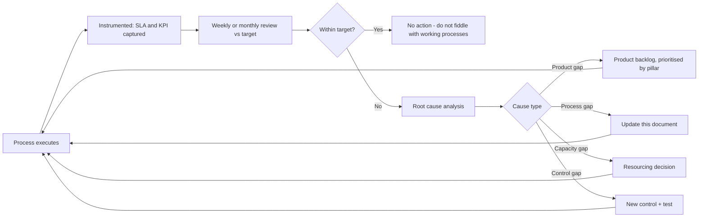

**Rules of the loop**
1. **A process without an SLA and a KPI is not managed.** If it appears here, it has both.
2. **A missed SLA gets a root cause, not a reminder.** Telling people to try harder is not process management.
3. **This document is updated when reality changes, in the same week.** A BPMS that describes how the company used to work is worse than none, because people stop trusting it and then stop reading it.
4. **Do not optimise a process that is inside target.** Attention goes to the biggest gap in Appendix C.
