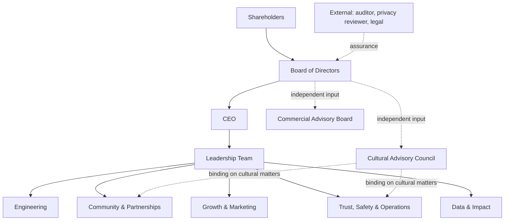

# CulturePass — Governance & Operating Model

**Version 1.0 · August 2026** · Owner: CEO · Adopted at seed close

---

## 1. Why this document exists

Two audiences require it before they will commit money. Investors need to see decision rights, financial control and board process. Government and philanthropic funders need to see governance, safeguarding, conflict-of-interest handling and cultural accountability. Both look for it early, and its absence reads as immaturity regardless of how good the product is.

It is also the document that stops the company from becoming one person's judgement at scale.

---

## 2. Governance structure

### 2.1 Board of Directors

Formed at seed close. Composition: **Founder/CEO · lead investor nominee · independent non-executive chair.** Expands to five at Series A with a second independent director holding public-sector or cultural-sector experience.

| Reserved matter — board approval required |
|---|
| Annual budget and any variance above 15% |
| Any capital raise, debt facility or convertible instrument |
| Hiring or removal of leadership team members |
| Any single contract above A$150,000 |
| Entry into a new country market |
| Changes to the fee model, including any change to the "free stays free" commitment |
| Overruling a Cultural Advisory Council determination *(requires unanimous board approval and a published rationale — see §4.3)* |
| Any sale, merger, or material IP transfer |

Meets quarterly, with monthly written CEO reporting between meetings.

### 2.2 Cultural Advisory Council

Constituted Q2 FY27. 6–9 paid members. **Holds binding authority on cultural matters** — see P13 in [`02-bpms.md`](02-bpms.md) for the full decision-rights table and escalation process.

This is the governance feature most likely to be dismissed as window dressing and most likely to determine whether the company survives its first serious cultural dispute. It is resourced as a real body: paid members, quarterly meetings, published determinations, and a binding remit.

### 2.3 Commercial Advisory Board

Informal, unpaid-with-equity, meets as needed. Target profiles: a marketplace operator who has scaled two-sided supply, an arts-sector executive with funding-body relationships, and a government-procurement specialist. Purpose is pattern-matching and doors, not oversight.

---

## 3. Decision rights

| Decision | Decides | Consults | Informs |
|---|---|---|---|
| Product roadmap priority | CEO | ENG, COM, DAT | Board |
| Individual ship / no-ship | ENG | CEO | — |
| Pricing and fee structure | Board | CEO, COM | All |
| Which city to enter next | Board | CEO, COM | All |
| Hire below leadership | Hiring manager | CEO | — |
| Leadership hire | Board | CEO | All |
| Marketing spend within budget | GRO | CEO | — |
| Paid spend above 25% of marketing budget | CEO | GRO, DAT | Board |
| Sponsor acceptance | CEO | TSO, CAC | Board |
| Sponsor requiring ranking influence | **Auto-reject** | — | Board (logged) |
| Cultural representation dispute | **CAC (binding)** | TSO, CEO | Board |
| Cultural taxonomy | **CAC** | ENG | All |
| Host suspension or removal | TSO | CEO | — |
| Grant application submission | CEO | DAT, COM | Board |
| Any external data release | DAT | TSO (privacy) | CEO |
| Manual financial action (refund exception, payout release) | CEO | — | Board (monthly log) |
| Incident declaration (P0/S1) | Any staff member | — | CEO immediately |

**Design principle:** the fastest decisions are pushed as low as possible; the irreversible ones are pushed as high as possible. Anything touching money, culture or safety escalates by default.

---

## 4. Key governance policies

### 4.1 Financial control

- **Segregation of duties.** The person who initiates a payout cannot approve a refund exception. In FY27, with a team of six, this means CEO approval on every manual financial action, logged and reported to the board monthly.
- **Held ticket funds are segregated under a trust-accounting treatment and are never used as working capital.** Pre-launch blocker. This is the single control most likely to be skipped by a fast-moving startup and most likely to end one.
- Daily three-way reconciliation (Stripe settlement / internal ledger / order records) with same-day exception resolution.
- External accountant performs monthly close; independent review annually, escalating to full audit when required by a funder or by the Corporations Act.
- Two-signature requirement on any payment above A$10,000.

### 4.2 Conflict of interest

All directors, CAC members, advisory board members and staff declare interests annually and at any point a new interest arises. Declarations are held in a register.

Specific to this company: **awards judging conflicts are published**, and any judge with a relationship to a nominee recuses from that category. A cultural awards program perceived as captured is worse than no awards program, and the perception is what matters.

### 4.3 Cultural authority and the limit on company power

Cultural Advisory Council determinations on cultural matters are **binding on the company**. Overruling one requires unanimous board approval and a published rationale.

The clause exists to make the cost of overruling explicit and public. A council whose decisions the company can quietly ignore is theatre, and communities recognise theatre immediately.

### 4.4 Data governance

| Principle | Commitment |
|---|---|
| Individual-level data | Never sold or shared with sponsors or advertisers. No exception, no price. |
| External reporting | Aggregate only, small-cell suppression (no cell below 5), privacy review before every release |
| Host data | Hosts see their own data first, before it appears in any external report |
| First Nations data | Indigenous Data Sovereignty principles; relevant communities control use of data about their activity, including the right to restrict aggregate reporting |
| Retention | Defined per data class; participant data deletable on request |
| Residency | Australian data in `ap-southeast-2`; regional deployments for EU and GCC before entry |

### 4.5 Safeguarding

Victorian Child Safe Standards compliance where events involve minors. Host attestation at publish time, with verification for high-risk categories. Named safeguarding contact. Incident reporting path to authorities, documented before launch rather than improvised during an incident.

### 4.6 Whistleblowing

Any staff member, host or community partner may raise a concern directly with the independent chair, bypassing the CEO. Contact published on the website. No retaliation, in policy and in practice.

---

## 5. Operating rhythm

See [`01-strategic-framework.md`](01-strategic-framework.md) §7 for the full cadence. The governance-specific layer:

| Cadence | Forum | Governance output |
|---|---|---|
| Monthly | CEO board report | KPIs vs model, cash and runway, risk register changes, manual financial actions log, incidents |
| Monthly | Leadership risk review | Register re-scored; any score ≥15 gets written status |
| Quarterly | Board meeting | OKR grading, re-forecast, reserved matters, control testing results |
| Quarterly | Cultural Advisory Council | Determinations, taxonomy, verification standards, awards governance |
| Quarterly | Control testing | Appendix B of the BPMS — each control tested to schedule |
| Annually | Strategy reset + governance review | Constitution of board and CAC reviewed; this document rewritten |
| Annually | Interest declarations | Register refreshed |

---

## 6. Reporting to funders and investors

| Audience | Frequency | Contents |
|---|---|---|
| Investors | Monthly | KPIs vs plan, cash and runway, wins, problems stated plainly, asks |
| Board | Monthly written + quarterly meeting | As above plus risk register, control testing, financial detail |
| Grant funders | Per funding agreement | Milestone progress, KPI evidence from platform data, acquittal on or before due date |
| Civic licensees | Monthly dashboard + quarterly review | Participation, representation, dispersal, economic impact |
| Sponsors | Monthly report + QBR | Reach, composition, campaign performance — verified data only |
| Community partners | Quarterly | What the platform did for them; what we got wrong |
| Public | Annual | Impact report: participation, communities represented, funds generated for hosts, awards recipients |

**Reporting principle:** bad news travels immediately and in full. An investor or funder who discovers a problem themselves has learned two things — the problem, and that we conceal problems. The second is the expensive one.

---

## 7. Scaling the model

| Trigger | Governance change |
|---|---|
| Seed close | Board formed; independent chair appointed; financial controls operational |
| Q2 FY27 | Cultural Advisory Council convened and paid |
| First civic contract | Government-grade security and privacy review; procurement compliance pack |
| First international market | Local entity assessment, local cultural advisory representation, data-residency review |
| Series A | Board expands to five; audit committee formed; second independent director with public-sector experience |
| 25 staff | Formal people policies, remuneration committee, dedicated finance hire |
| 50 staff | Internal audit function; full external audit |

**Anti-pattern to avoid:** adding governance structure faster than the company can actually run it. A company of six with four committees is performing governance rather than doing it. Each row above is triggered by a real event, not by a calendar.
