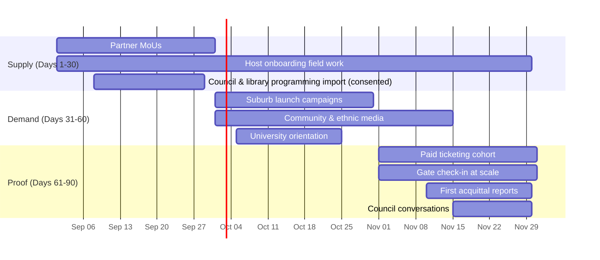

# CulturePass — Melbourne Pilot Playbook (90 Days)

**Launch window: September–November 2026** · Owner: Community & Partnerships Lead, accountable to CEO
This is an execution document. It is written to be worked from, week by week, and rewritten from what actually happens so that city two is faster.

---

## 1. Why Melbourne, and why these six suburbs

Melbourne has the deepest concentration of active multicultural community organisations in Australia and the deepest funding infrastructure behind them (Creative Victoria, the Victorian Multicultural Commission, City of Melbourne, and 30 metro councils each running cultural programs). The product was built for it — Melbourne is the default city and the demo hosts are a Kerala collective and a Collingwood arts space.

**Density beats coverage.** A feed with 400 events in six suburbs is a product; 2,400 events spread across Greater Melbourne is a directory nobody uses. The six:

| Suburb | Cultural density | Primary communities | Why |
|---|---|---|---|
| **Footscray / West Footscray** | Very high | Vietnamese, Ethiopian, Eritrean, Sudanese, Indian | Dense, walkable, strong existing event culture, transit-connected |
| **Dandenong** | Very high | Afghan, Sri Lankan, Indian, Sudanese, Pacific Islander | Largest concentration of newly-arrived communities in Victoria |
| **Brunswick / Coburg** | High | Greek, Italian, Lebanese, Turkish, plus contemporary arts | Established diaspora institutions alongside a young arts scene — unusually good mix |
| **Springvale / Clayton** | Very high | Vietnamese, Chinese, Cambodian, Indian | Monash student population overlays established communities |
| **Collingwood / Fitzroy** | High | Contemporary arts, First Nations organisations, live music | Arts-space density; high publish frequency per host |
| **Preston / Reservoir** | Medium-high | Italian, Greek, Somali, Indian, Nepalese | Emerging, under-served by existing discovery, less competition |

Each suburb gets a named target list and a weekly density number. Progress is reviewed per suburb, never in aggregate — aggregate numbers hide the failure that matters.

---

## 2. The 90-day shape

**Hard rule: no consumer marketing spend until 120 hosts and 300 events are live.** Breaking this rule is the single most common way a two-sided pilot fails — you spend money driving people to an empty room, they never return, and you have burned the only first impression you get.

---

## 3. Days 1–30 — Supply

### Objective
120 verified hosts, 300 published events, ≥8 events/week in at least 4 of 6 suburbs.

### Week 1 — Foundation
- [ ] Target list built: 400 named organisations across the six suburbs (source: council directories, ACNC register, ethnic community council member lists, place-of-worship directories, arts-space listings)
- [ ] CRM configured with immutable source attribution
- [ ] Host onboarding kit produced: one-page explainer, 3-minute publish video, printable QR poster template — **all in English plus the 8 priority languages**
- [ ] Verification process live and staffed (P02); target 3-day turnaround from day one
- [ ] 20 outreach conversations opened, prioritising warm and referred contacts

### Week 2 — Partner leverage
- [ ] 6 peak-body / ethnic community council meetings held
- [ ] 3 MoUs in progress (offer: free Professional tier for all members, co-branded collection page, aggregate participation reporting they can use for their own funding)
- [ ] Council conversations opened with 4 LGAs — starting with events and libraries teams, who publish constantly and have the least friction, not with the strategy teams
- [ ] 40 hosts contacted, 15 onboarded
- [ ] First Nations organisation outreach begins — **relationship-led, no campaign framing, no deadline pressure.** If it takes six months, it takes six months.

### Week 3 — Volume
- [ ] 50 hosts onboarded cumulative
- [ ] 120 events published
- [ ] Council/library programming onboarded with explicit consent (high volume, low friction, establishes a floor of density under the community events)
- [ ] Verification backlog under 2 days
- [ ] First host success check-ins at day 7 — diagnose every host who signed up and did not publish

### Week 4 — Density check and gate
- [ ] 120 hosts onboarded, 300 events published
- [ ] Per-suburb density measured; the two weakest suburbs get all field time in week 5
- [ ] Empty search rate measured against a seeded query set
- [ ] **GATE: do not proceed to consumer marketing unless ≥4 suburbs are at ≥8 events/week**

### Field playbook — the actual conversation

The 12-minute version, in person, at their venue, phone in hand:

1. **Ask about their event first.** How many people usually come? How do they hear about it? Listen. This is not a pleasantry — it is where the product roadmap comes from.
2. **Name their real problem back to them.** Usually: "the same people come every year" or "we spend all our time on admin."
3. **Show the feed for their suburb on a phone.** Real events, real communities. Not a slide.
4. **Publish their next event with them, right there.** Under three minutes. This is the whole pitch. A host who has published cannot un-know how easy it was.
5. **Be explicit about money.** "Free events are free. Always. If you sell tickets, it's 3.5% plus 80 cents." Say the number. Vagueness about pricing reads as a trap.
6. **Name the grant angle.** "At the end you get a report you can put in your next funding application." For a grant-dependent organisation this is often the moment the conversation changes.
7. **Ask for one introduction.** Every host knows three other hosts. This is where the 40% partner-channel target comes from.

**What not to do:** do not pitch the vision, do not mention the app's technology, do not use the word "platform", and do not ask them to leave their WhatsApp group.

---

## 4. Days 31–60 — Demand

### Objective
8,000 registered participants, 25,000 cumulative attendances, activation rate ≥45%.

### Suburb-by-suburb launch, not a city launch

Each suburb gets a two-week concentrated push, staggered so learnings from Footscray improve Dandenong:

| Week | Suburbs |
|---|---|
| 5–6 | Footscray, Collingwood |
| 6–7 | Dandenong, Brunswick |
| 7–8 | Springvale, Preston |

### Per-suburb launch kit
- Suburb landing page listing every event on the platform there
- Host-led push: every host in the suburb shares their own event to their own list on the same weekend — a coordinated, high-density moment
- Printed QR posters in grocery shops, community halls, libraries, places of worship, cafés (this channel is unfashionable and works)
- Local council newsletter placement
- Community radio and in-language media — editorial angle, real host names
- Local business offers live, so businesses promote us to drive their own redemptions
- Small geo-targeted paid retargeting only, capped

### University orientation (weeks 5–8)
Melbourne, Monash, RMIT, Deakin, Victoria University. International student orientation is the densest concentration of high-intent cultural participants in the country and it happens on a fixed calendar. Offer to student unions and cultural societies: free Professional tier, a co-branded societies collection page, and a "first month in Melbourne" cultural guide.

### Media plan
- **Angle that works:** "The organisers who keep Melbourne's cultural life running finally have tools" — named hosts, real events, human story.
- **Angle that does not work:** "New app launches." Nobody covers app launches.
- Targets: local and community press, ethnic and in-language media, SBS language programs, 3ZZZ, council communications, arts-sector newsletters.

---

## 5. Days 61–90 — Prove the loop

### Objective
First paid ticketing cohort, ≥80% check-in rate, first acquittal reports delivered, first council conversation backed by real data.

### Week 9–10 — Transactions
- [ ] 30 hosts activated on paid ticketing, coached individually
- [ ] Stripe production verified end to end with real money
- [ ] First 1,000 paid tickets
- [ ] Check-in coached at the door for the first 10 paid events — **be physically present at these.** Everything wrong with the gate flow is learned here and nowhere else.
- [ ] Payment failure rate under 2%; zero payment incidents

### Week 11 — The retention product
- [ ] Acquittal report shipped and delivered to the first 20 hosts
- [ ] Sit with 5 hosts while they read it. What do they not understand? What do they wish it said? Their next grant application is the acceptance test.
- [ ] Post-event reports automated at T+24h
- [ ] Month-3 retention measured on the first host cohort

### Week 12 — Evidence and gate review
- [ ] Civic dashboard v1 built from real data (participation by community, suburb dispersal)
- [ ] Presented to 4 councils — **with their own suburb's real data in it.** A generic demo gets a polite meeting; their own data gets a procurement conversation.
- [ ] Culture Passion Awards nominations opened
- [ ] Full pilot review against all gates, written up honestly, published internally
- [ ] City-launch playbook rewritten from what actually happened — this document, corrected

---

## 6. Targets and gates

| Metric | Day 30 | Day 60 | Day 90 | Source |
|---|---|---|---|---|
| Verified hosts | 120 | 190 | 260 | P01 |
| Published events | 300 | 620 | 1,000 | P03 |
| Events/week in ≥4 suburbs | ≥8 | ≥12 | ≥15 | P06 |
| Empty search rate | <30% | <20% | <15% | P06 |
| Registered participants | 800 | 8,000 | 18,000 | P05 |
| Activation rate (14 days) | — | ≥40% | ≥45% | P05 |
| Verified attendances (cumulative) | 1,500 | 25,000 | 55,000 | P08 |
| Paid tickets | 0 | 200 | 3,500 | P07 |
| Check-in rate (paid) | — | ≥75% | ≥80% | P08 |
| Host month-1 retention | — | ≥70% | ≥70% | P01 |
| Acquittal reports delivered | 0 | 0 | 20 | P11/P14 |
| Councils in active pipeline | 4 | 5 | 6 | P10 |

### Stop / continue decision at day 90

| Condition | Decision |
|---|---|
| ≥80% of targets met | Continue to the FY27 full-year plan; begin Sydney/Brisbane partnership groundwork in Q3 |
| 50–80% met | Continue Melbourne only. No expansion planning. Root-cause the misses and re-run the weakest 30 days. |
| <50% met | Stop and re-examine the wedge. Is discovery actually the entry point, or is it organiser tooling? This is a strategy question, not an execution question, and it goes to the board. |

---

## 7. Team and budget

**Team:** COM full-time in the field · CEO 40% on partnerships, councils and funding · GRO from week 3 · ENG on payments/auth hardening and check-in reliability · TSO from week 6 on verification and moderation volume.

**Pilot budget: A$62,000 of the FY27 A$180,000 marketing allocation.**

| Line | Amount | Note |
|---|---|---|
| Field work (travel, venue, materials, translation) | 8,000 | Translation into 8 languages is the largest single item here and non-negotiable |
| Printed QR posters and suburb kits | 6,000 | Unfashionable channel, works |
| Ethnic & community media | 14,000 | Editorial placements, not display ads |
| University & student channels | 7,000 | Fixed orientation calendar |
| Content & suburb landing pages | 8,000 | Compounding asset |
| Paid retargeting (capped) | 12,000 | 19% of pilot spend |
| Host incentives & referral credits | 5,000 | |
| Contingency | 2,000 | |

---

## 8. What will probably go wrong

Written before it happens, so the response is a decision rather than a scramble:

| Likely problem | Early signal | Response |
|---|---|---|
| Hosts sign up but do not publish | Day-7 check-in failures | Publish *with* them, in person. If more than 20% stall at the same wizard step, it is a P0 product bug, not a training problem. |
| One suburb badly underperforms | Weekly density | Move all field time there for two weeks. If still failing at week 8, substitute a seventh suburb rather than propping it up. |
| Check-in not happening at the door | Zero check-ins on completed paid events | Be physically present. Likely causes are no venue connectivity (needs offline mode) or the host never opened the scanner (needs a T-2h reminder). |
| Paid ticketing adoption slow | Paid share below 15% at day 90 | Expected and survivable. Free-event density is the FY27 priority; transaction revenue is only 26% of FY27 platform revenue. Do not chase it at the cost of density. |
| A community relationship goes wrong | Partner feedback, silence after a good first meeting | CEO makes the repair call personally. Ask what we got wrong. Do not defend. |
| Council interest but no procurement path | Enthusiasm without a next step | Ask directly who holds the budget and what their financial-year timing is. Enthusiasm from someone with no budget authority costs six months. |
| Media ignores us | No coverage by week 8 | The angle is wrong. Lead with a host, not with the company. Offer an exclusive with a named organiser. |

---

## 9. What must be captured for city two

The pilot's second deliverable, after the metrics, is a **repeatable playbook**. Capture continuously, not retrospectively:

- Time-and-motion on host onboarding: how many contacts per onboarded host, by source
- Which outreach opening lines worked, verbatim
- Which partner types produced the most member conversions
- Cost per host and per participant by channel, actual not modelled
- Every product friction point encountered in the field, with frequency
- Suburb selection criteria, validated or corrected against what actually happened
- The full translation and materials kit, reusable
- Council conversation transcripts: what they asked, what stopped them, who held the budget

**If the pilot succeeds and this is not captured, city two costs the same as city one — and the entire expansion thesis in the business plan assumes it does not.**
