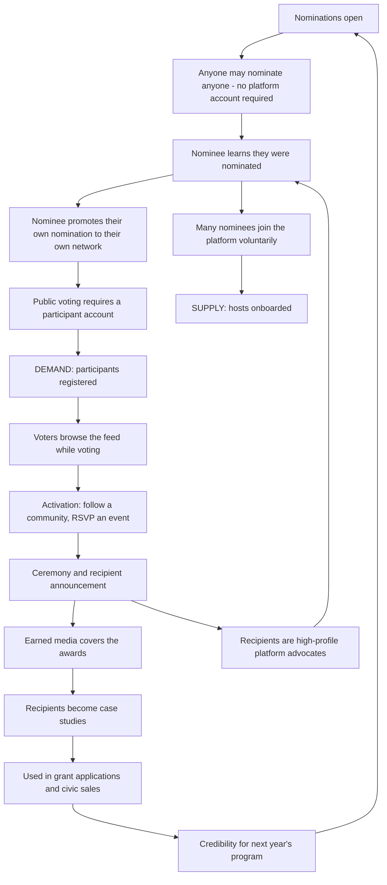

# The Culture Passion Awards — Program Charter

**Inaugural year: 2027 (FY27)** · Program owner: CEO (FY27), Awards Program Manager (FY29+)
Governance: judging criteria and panel approved by the Cultural Advisory Council.

---

## 1. Purpose

The Culture Passion Awards honour the people who keep cultural life alive — the elders teaching an endangered art form, the volunteer running a 4,000-person festival from a spreadsheet, the twenty-three-year-old putting traditional music through a synthesiser, the two communities who decided to do something together.

These people are almost never recognised. Arts awards go to funded institutions and professional practitioners. Community awards go to service delivery. The person who has run the same cultural festival for nineteen years without being paid has no category.

**That is the gap this program fills, and it is also — stated plainly — CulturePass's most efficient acquisition channel.** Both things are true, and pretending otherwise would be the kind of dishonesty this program cannot afford.

---

## 2. The dual mandate, stated honestly

| Mandate | What it means | How it is measured |
|---|---|---|
| **Recognition** | Real money and real recognition to people doing uncompensated cultural work | Recipients funded; recipient-reported impact 12 months on |
| **Acquisition** | Nominees promote their own nomination to their own networks; voting requires an account; voters browse the feed while voting | Hosts and participants acquired; cost per acquisition |

**Why saying this out loud is the right call:** a community sector that has been marketed at for decades recognises an acquisition play immediately. Naming it, and then designing the program so the recognition is genuinely valuable regardless, is more credible than pretending the program is pure philanthropy. The test is simple and applied every year: *would a recipient say this was worth their time even if they never used CulturePass again?* If the answer is no, the program has failed on its own terms.

---

## 3. Award categories

| Award | Who | What they receive |
|---|---|---|
| **Heritage Guardian** | Elders, historians and traditional performers preserving endangered art forms, languages, crafts or practices | **A$2,500 unrestricted micro-grant** + permanent platform spotlight + professional documentation of their practice (photography and a written profile, theirs to keep and use) |
| **Community Vanguard** | Grassroots festival organisers, market directors, community event leaders operating at scale on volunteer capacity | **A$5,000 platform credit** + **zero-fee ticketing for 12 months** + featured placement + an operations consultation |
| **Youth Cultural Pioneer** | Under-30 innovators blending contemporary mediums with traditional culture | **A$2,500 unrestricted grant** + a dedicated feature campaign + 6 months of mentorship from an established practitioner (paid mentor) |
| **Global Bridge** | Cross-cultural collaboration projects — two or more communities creating something together | **A$3,000 project grant** + co-marketing with a regional tourism or cultural body + cross-community feature |

### Category design notes

- **Heritage Guardian is unrestricted cash.** Not credit, not in-kind. An 82-year-old teaching a dying craft does not need platform credit; they need money and to be seen. Any pressure to convert this to credit should be refused — it is the category that establishes the program's integrity.
- **Community Vanguard is credit and fee relief**, because that segment's constraint genuinely is operating cost, and zero-fee ticketing for a year on a 4,000-person festival is worth considerably more than A$5,000 cash.
- **Youth Pioneer mentorship is paid.** Unpaid mentorship from busy practitioners does not happen reliably, and asking for it free reproduces exactly the extraction the program exists to counter.
- **Global Bridge requires two or more distinct communities** with a demonstrated joint project. Not a multicultural festival with many stalls — an actual collaboration.

### Recipients per year

| | FY27 (inaugural) | FY28 | FY29 |
|---|---|---|---|
| Heritage Guardian | 2 | 5 | 12 |
| Community Vanguard | 1 | 4 | 10 |
| Youth Cultural Pioneer | 1 | 4 | 10 |
| Global Bridge | 1 | 3 | 8 |
| **Total recipients** | **5** | **16** | **40** |
| Geography | Melbourne | 5 AU cities | 8 cities, 3 countries |

---

## 4. Program budget

### FY27 — A$95,000

| Line | Amount |
|---|---|
| Prize pool (2 × A$2,500 + A$5,000 credit + A$2,500 + A$3,000) | 15,500 |
| Zero-fee ticketing forgone revenue (Community Vanguard, 12 months) | 4,500 |
| Paid mentorship (Youth Pioneer) | 3,000 |
| Ceremony: venue, catering, AV, accessibility (Auslan interpreting, captioning) | 22,000 |
| Documentation: photography, videography, written profiles for all recipients | 14,000 |
| Judging panel honoraria (7 judges) | 8,400 |
| Cultural Advisory Council time on awards governance | 3,600 |
| Campaign creative and production | 9,000 |
| In-language translation of all nomination materials (8 languages) | 6,500 |
| Media and PR | 5,000 |
| Recipient travel and access support | 3,500 |
| **Total** | **95,000** |

### Three-year program economics

| | FY27 | FY28 | FY29 |
|---|---|---|---|
| Sponsorship revenue | 0 | 260,000 | 900,000 |
| Program cost | 95,000 | 340,000 | 980,000 |
| **Net cost** | **(95,000)** | **(80,000)** | **(80,000)** |
| Hosts acquired via awards | 25 | 150 | 430 |
| Participants acquired via awards | 5,040 | 34,000 | 118,000 |
| Effective cost per host acquired | A$17.20/participant blended | — | — |

The program runs at a planned net cost of roughly A$80–95k a year. **Judged as an acquisition channel rather than a business line, that is efficient** — A$95,000 in FY27 to deliver 400+ nominations (each requiring a host profile) and 15,000+ votes (each requiring a participant account). If a presenting partner is secured in FY27, this reaches breakeven a year early.

**Budget protection rule:** the prize pool and recipient documentation are never cut. If sponsorship underdelivers, the ceremony scales down — a smaller venue, a simpler event. Cutting recipient value to fund a better party would invert the entire purpose, and it is exactly the compromise that gets made when budgets tighten unless it is prohibited in advance.

---

## 5. How the acquisition flywheel works

**Why this works where a normal marketing campaign does not:** the nominee does the distribution. A person nominated for an award tells everyone they know, and the people they tell are precisely the audience we want — already interested in that community's cultural life. It is word-of-mouth acquisition with a legitimate reason to exist.

### The gate that was removed, and why

An earlier design required nominees to hold a CulturePass community profile. **That requirement has been dropped.** Anyone may nominate anyone, and a nominee does not need to be on the platform to be shortlisted or to win.

Two reasons. Reputationally, a gate makes the awards feel like a lead-generation form — and the charter's own disqualifying-failure test (§7) cannot survive an award that is conditional on signing up. Structurally, if the Awards move to a charitable foundation in FY28 (see [`../06-funding/08-entity-and-foundation-strategy.md`](../06-funding/08-entity-and-foundation-strategy.md)), a grant program gated on registering with an affiliated for-profit platform confers a private benefit on that company — which is precisely the pattern that puts DGR endorsement at risk.

**What this costs, stated plainly:** the supply-side mechanic weakens. Awards-driven host acquisition is re-forecast from 40 to **25–30 in FY27**. Acquisition now comes indirectly: nominees encounter the platform, see the feed, and a good share of them join because they want to — not because a form required it.

**What is retained:** voting still requires an account. That is a normal ballot-integrity control against vote-stuffing, not a gate on the award, and it preserves most of the demand-side acquisition.

**The constraint that keeps it honest:** nomination must be genuinely easy — under 5 minutes, available in 8 languages, no account required. See [`02-rules-eligibility-judging.md`](02-rules-eligibility-judging.md).

---

## 6. Governance

| Decision | Authority |
|---|---|
| Program-owning entity | CulturePass Pty Ltd in FY27; **Culture Passion Foundation from FY28**, subject to the four triggers in [`../06-funding/08-entity-and-foundation-strategy.md`](../06-funding/08-entity-and-foundation-strategy.md) §7 |
| Categories and criteria | CEO proposes, **Cultural Advisory Council approves** |
| Judging panel composition | **Cultural Advisory Council approves** |
| Recipient selection | **Independent judging panel decides.** Company has no vote. |
| Sponsor involvement | Sponsors have **no vote and no influence** on recipients. Contractual. |
| Conflict of interest | Declared and **published**; any judge with a relationship to a nominee recuses from that category |
| Prize payment | Paid **directly to the recipient**, not routed through a sponsor |
| Disputes | Cultural Advisory Council, binding |

**The non-negotiables**, because these are the exact points where a well-intentioned awards program becomes a discredited one:

1. Sponsors do not choose recipients, and cannot see the shortlist before it is public.
2. Prize money goes directly to recipients. No sponsor branding on a cheque handover as a condition of payment.
3. Judges are paid, and conflicts are published.
4. CulturePass staff do not vote.
5. A recipient may decline the platform-promotion component and keep the money and the recognition. If the award is conditional on marketing participation, it is not an award — it is a sponsorship deal, and it should be described as one.

---

## 7. Success measures

### Recognition mandate

| Measure | FY27 target |
|---|---|
| Recipients funded and paid | 5, within 14 days of ceremony |
| Recipients who would recommend being nominated | ≥90% (surveyed) |
| Recipient-reported benefit at 12 months | Qualitative follow-up on all recipients, published |
| Distinct cultural communities among nominees | ≥25 |
| Nominations from non-English-language submissions | ≥20% |
| First Nations nominees | ≥5, via relationship-led outreach not campaign targeting |

### Acquisition mandate

| Measure | FY27 target |
|---|---|
| Nominations received | ≥400 |
| Public votes cast | ≥15,000 |
| Hosts acquired via nomination (re-forecast, gate removed) | ≥25 |
| Participants acquired via voting | ≥5,000 |
| Earned media placements | ≥8 |
| Cost per acquired participant | ≤A$18 |

### The disqualifying failure

If the program delivers its acquisition targets but recipients report it was not worth their time, **the program has failed and is redesigned before the next cycle.** This is written into the charter specifically so that a strong acquisition result cannot be used to declare success over the objection of the people it exists to serve.

---

## 8. Three-year arc

| Year | Scope | Positioning |
|---|---|---|
| **FY27** | Melbourne. 5 recipients. Small, credible, well-documented. | "A new award for people who have never had one" |
| **FY28** | 5 Australian cities. 16 recipients. Presenting partner. State-government recognition sought. | "Australia's award for cultural community leadership" |
| **FY29** | 8 cities, 3 countries. 40 recipients. Regional ceremonies plus a global showcase. | "The global recognition for cultural community leadership" |

**Sequencing discipline:** a small, genuinely excellent inaugural year is worth far more than a large, thin one. The FY27 program has five recipients on purpose. An awards program's authority comes from the perceived quality of who has won it, and that is set in year one and very hard to correct afterwards.
