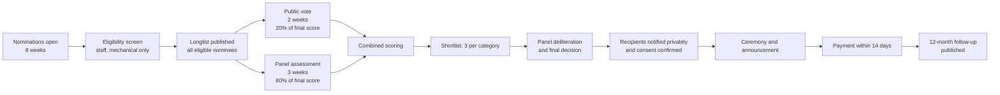

# Culture Passion Awards — Rules, Eligibility & Judging

**Inaugural year 2027** · Approved by the Cultural Advisory Council · Published in full before nominations open.

Publishing the rules in full, before nominations, is the point. An awards program whose criteria appear after the winners is not an awards program.

---

## 1. Eligibility

### General

| Requirement | Detail |
|---|---|
| Geography | FY27: activity primarily in Greater Melbourne. FY28: Australia. FY29: Australia, New Zealand, UAE, UK. |
| Nominee type | Individuals, unincorporated groups, incorporated associations, or organisations. **An ABN is not required.** Most of the people this program exists for do not have one. |
| Platform account | **Not required.** A nominee does not need to be on CulturePass to be nominated, shortlisted, or to win. |
| Activity period | Cultural work undertaken or continuing within the 24 months before nominations close |
| Age | No minimum or maximum, except Youth Cultural Pioneer (under 30 at nomination close) |
| Self-nomination | Permitted, and explicitly encouraged — many eligible people have nobody positioned to nominate them |
| Previous recipients | May not win the same category twice; may be nominated in a different category after 24 months |

### Not eligible

- CulturePass staff, directors, contractors, and their immediate families
- Cultural Advisory Council members and judging panel members, and their immediate families
- Sponsors, their employees, and organisations they control
- Activity that is primarily commercial with no community or cultural-preservation dimension
- Political campaigning, or activity whose primary purpose is religious conversion (**cultural activity by a faith community is fully eligible** — the distinction is purpose, not venue)
- Any nominee subject to an unresolved safeguarding or serious misconduct finding

---

## 2. Category criteria and weightings

### Heritage Guardian — A$2,500 unrestricted

*Elders, historians and traditional performers preserving endangered art forms, languages, crafts or practices.*

| Criterion | Weight | What the panel looks for |
|---|---|---|
| Endangerment of the practice | 30% | How at-risk is this knowledge? Is transmission actually breaking? |
| Depth and duration of contribution | 30% | Years of practice; body of work; standing within the community |
| Transmission to others | 25% | Is it being taught? To whom? Is anyone continuing it? |
| Continuing need | 15% | Would recognition and A$2,500 make a real difference now? |

### Community Vanguard — A$5,000 credit + 12 months zero-fee ticketing

*Grassroots festival organisers, market directors and community event leaders operating at scale on volunteer capacity.*

| Criterion | Weight | What the panel looks for |
|---|---|---|
| Scale relative to resources | 35% | 4,000 attendees on volunteer labour beats 400 with a paid team |
| Sustained delivery | 25% | Years running; survived leadership change or funding loss |
| Community benefit | 25% | Who participates, and who would have nothing without it |
| Operational constraint | 15% | Would fee relief and credit actually change what they can do? |

### Youth Cultural Pioneer — A$2,500 + paid mentorship

*Under-30 innovators blending contemporary mediums with traditional culture.*

| Criterion | Weight | What the panel looks for |
|---|---|---|
| Originality of the fusion | 30% | Genuine synthesis, not decoration |
| Cultural grounding | 30% | Real knowledge of the tradition being drawn on — **this weighting is deliberate**: innovation without grounding is appropriation, including by young people from within the culture |
| Reach and resonance | 20% | Is it landing with an audience, particularly a young one? |
| Trajectory | 20% | Would mentorship and A$2,500 change what happens next? |

### Global Bridge — A$3,000 project grant + co-marketing

*Cross-cultural collaboration projects: two or more communities creating something together.*

| Criterion | Weight | What the panel looks for |
|---|---|---|
| Genuine collaboration | 35% | Shared authorship and shared decisions. **A multicultural festival with many separate stalls is not a collaboration.** |
| Difficulty of the bridge | 25% | Communities with distance, historical tension, or no prior contact between them |
| Artistic or cultural outcome | 20% | Did something worthwhile actually get made? |
| Durability | 20% | Will the relationship outlast the project? |

---

## 3. Process

### Public vote: 20%, and why not more

The public vote exists for reach and for legitimacy — people should have a say, and voting is the demand-side acquisition mechanic. It is capped at 20% for a specific reason: **an unweighted popular vote systematically rewards the largest and best-resourced community over the most endangered practice.** An 82-year-old teaching a dying craft to four students will never out-vote a 5,000-member association, and if the vote decided the outcome, the Heritage Guardian category would be meaningless.

Vote integrity controls:
- One vote per verified account per category
- Account required to vote (this is a ballot-integrity control, not a gate on nomination)
- Rate limiting and duplicate-device detection
- Vote counts are **not** displayed live — live counts turn the awards into a mobilisation contest and drown out the panel
- Anomalous voting patterns are investigated, and the panel may discount a compromised category's public component entirely

---

## 4. Judging panel

### Composition (7 members, FY27)

| Seats | Profile |
|---|---|
| 2 | First Nations cultural practitioners or leaders |
| 2 | Diaspora community cultural leaders (rotating communities each year) |
| 1 | Arts sector practitioner or curator |
| 1 | Community sector / cultural policy background |
| 1 | Previous recipient *(from FY28 onward; FY27 uses a second arts practitioner)* |

Panel composition is approved by the Cultural Advisory Council. **CulturePass staff do not sit on the panel and do not vote.**

### Panel terms

- **Paid.** A$1,200 honorarium per judge for the FY27 cycle. Unpaid judging by community leaders reproduces the extraction this program exists to counter.
- Two-year terms, staggered, maximum two consecutive terms
- Conflict-of-interest declarations completed before seeing nominations, and **published**
- Any judge with a relationship to a nominee recuses from that entire category, not merely from that nominee
- Deliberations are confidential; the reasoning for each recipient is published

### Scoring

Each judge scores independently against published criteria before any group discussion — **independent scores first, discussion second.** Discussion-first panels converge on whoever spoke most persuasively in the room.

Scores are aggregated, then the panel deliberates on the top three per category. A recipient requires majority panel support. Ties are resolved by the panel chair, who records the reasoning.

---

## 5. Nomination form

Deliberately short. Under 5 minutes. Available in English, Mandarin, Arabic, Vietnamese, Hindi, Punjabi, Greek, Italian and Malayalam. Accepted by web form, email, phone (staff transcribe), or on paper at a partner organisation.

| Field | Required |
|---|---|
| Nominee name and contact (or "I don't have their contact") | ✅ |
| Category | ✅ |
| Community / cultural practice | ✅ |
| **"Why does this person or group deserve recognition?" (150–500 words)** | ✅ |
| How long have they been doing this | ✅ |
| Anything that shows their work — links, photos, or nothing at all | Optional |
| Your name and relationship to the nominee | ✅ |
| Whether the nominee knows about the nomination | ✅ |

**Design notes that matter:**
- **Supporting material is optional.** Requiring a portfolio, references or documentation selects for the already-professionalised and excludes exactly the people this program is for.
- Phone and paper nomination routes exist because some of the most deserving nominees are connected to people who will not fill in a web form.
- If the nominee does not know, staff contact them for consent before the longlist is published. Nobody is publicly nominated without their knowledge.

---

## 6. Integrity and appeals

| Safeguard | Rule |
|---|---|
| Sponsor influence | **Zero.** Sponsors have no vote, cannot see the shortlist before it is public, and cannot veto a recipient. Contractual. |
| Payment route | Prize money is paid **directly to the recipient.** No sponsor-branded handover as a condition of payment. |
| Promotion is optional | A recipient may decline all platform promotion and keep the money and the recognition. If the award were conditional on marketing participation it would be a sponsorship deal, not an award. |
| Staff involvement | Eligibility screening only, and that screen is mechanical (dates, category, exclusions). No merit judgement. |
| Published reasoning | A short published statement of why each recipient was selected |
| Appeals | An excluded nominee may appeal the **eligibility** decision within 14 days, to the Cultural Advisory Council. Merit decisions are final and not appealable. |
| Withdrawal | A recipient may decline the award at any point before announcement, with no explanation required |
| Adverse findings | If a serious safeguarding or misconduct matter emerges after selection, the award is withheld pending Cultural Advisory Council review |

---

## 7. Recipient obligations — deliberately minimal

| Obligation | Detail |
|---|---|
| Accept the award | Confirm acceptance and identity for payment |
| Nothing else is required | No reporting, no acquittal, no promotional participation, no platform sign-up |
| Requested but optional | Attend the ceremony (travel and access costs covered); participate in documentation; a 12-month follow-up conversation |

**Why the grants are unrestricted:** an A$2,500 grant with reporting requirements attached costs the recipient more in administrative time than the grant is worth. That is a real and common failure in small-grant programs. The 12-month follow-up is a conversation for our own learning and for public reporting, not an acquittal, and a recipient may decline it.
