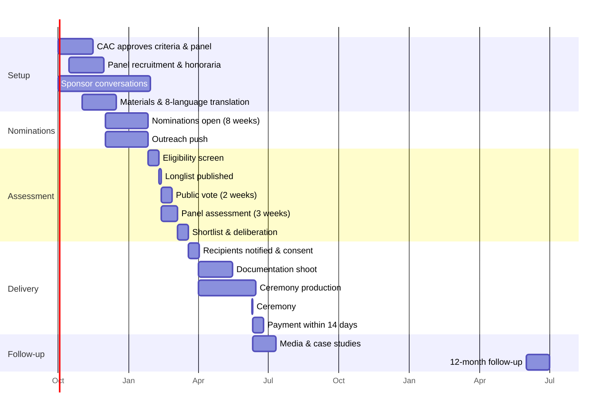

# Culture Passion Awards — Operations Timeline (FY27 Inaugural)

**Owner: CEO (FY27)** · Ceremony target: **June 2027**, aligned to National Reconciliation Week / Refugee Week season when cultural-participation attention is highest and civic audiences are most receptive.

---

## 1. Master timeline

---

## 2. Phase detail

### Phase 1 — Setup (Oct–Nov 2026)

| Week | Deliverable | Owner |
|---|---|---|
| Oct W1 | Draft criteria and category definitions to Cultural Advisory Council | CEO |
| Oct W2 | Panel candidate longlist (14 names for 7 seats), honoraria budgeted | CEO |
| Oct W3 | Sponsor outreach opens — presenting partner and category partners | CEO |
| Oct W4 | **CAC approves criteria and panel composition** | CAC |
| Nov W1 | Panel confirmed, honoraria contracted, conflict declarations collected | CEO |
| Nov W2 | Nomination form built; phone and paper routes operational | ENG + TSO |
| Nov W3 | All materials translated into 8 priority languages by human reviewers | GRO |
| Nov W4 | Rules published in full; partner organisations briefed | GRO |

**Gate:** rules published and panel confirmed before a single nomination is accepted. Non-negotiable.

### Phase 2 — Nominations (Dec 2026 – Jan 2027, 8 weeks)

Eight weeks, spanning the summer holiday period. That is deliberate — community organisations are busiest with events in Dec–Jan, which is precisely when they are most visible to the people who would nominate them.

| Channel | Action | Target |
|---|---|---|
| Partner organisations | 40 peak bodies, councils, migrant resource centres, libraries asked to circulate | 150 nominations |
| Community media | In-language press and radio, editorial angle | 80 nominations |
| Platform | In-app prompts, digest features, host emails | 100 nominations |
| Direct outreach | Staff nominate people they encountered in pilot fieldwork, with consent | 40 nominations |
| Paper and phone | Forms at partner venues; staffed phone line | 30 nominations |
| **Total** | | **≥400** |

**Weekly tracking:** nominations by category, by community, by language, by channel. Two specific watch-items:
- **Heritage Guardian will under-nominate.** Elders are the least likely to be nominated by an online form. If the category is under 40 nominations at week 4, staff conduct direct outreach through community elders' groups and places of worship.
- **First Nations nominations require relationship-led outreach, not campaign targeting.** Begin in October, through existing relationships, with no deadline pressure. If it produces two nominations rather than five, that is an honest result — inflating it with a campaign push would be worse.

### Phase 3 — Assessment (Feb – Mar 2027)

| Week | Activity | Owner |
|---|---|---|
| Feb W1–2 | Eligibility screen (mechanical only: dates, category, exclusions) | TSO |
| Feb W2 | Nominee consent confirmed for anyone who did not know they were nominated | TSO |
| Feb W2 | **Longlist published** — all eligible nominees, no ranking | GRO |
| Feb W2–3 | **Public vote opens, 2 weeks.** Counts not displayed live. | ENG |
| Feb W2–Mar W1 | Panel independent scoring, 3 weeks — **scores submitted before any group discussion** | Panel |
| Mar W1 | Combined scoring: 80% panel / 20% public | CEO |
| Mar W2 | Panel deliberation on top 3 per category; recipients decided | Panel |
| Mar W3 | Vote-integrity review; anomalies investigated before results are locked | ENG + TSO |

### Phase 4 — Delivery (Mar – Jun 2027)

| Timing | Activity |
|---|---|
| Mar W3–4 | Recipients notified **privately**; acceptance and identity confirmed for payment; promotion consent asked (and may be declined) |
| Apr | Documentation: professional photography, written profile, short video for each recipient — **theirs to keep and use, in their own name** |
| Apr–May | Ceremony production: venue, catering, AV, **Auslan interpreting and live captioning**, accessible venue, recipient travel and access support |
| May | Media embargo pack prepared; sponsors briefed on announcement (recipients **not** disclosed to sponsors before public announcement) |
| **10 Jun 2027** | **Ceremony** |
| Jun W2–3 | **Payment within 14 days of ceremony** — tracked as a hard commitment |
| Jun W3–4 | Media follow-up, case studies, recipient spotlights on platform |

**Ceremony design principles**
- Recipients and their communities are the guests of honour, not the sponsors. Seating, speaking order and run sheet reflect that.
- Recipients' travel, accommodation and access costs are covered. An award someone cannot afford to attend is not an award.
- Cultural protocol: Welcome to Country, and cultural performance programmed **with** communities, paid at professional rates.
- Catering respects dietary and religious requirements as a design requirement, not an afterthought.
- Speeches are short. Recipients speak longer than the company does.

### Phase 5 — Follow-up

| Timing | Activity |
|---|---|
| Jul 2027 | Recipient survey: would you recommend being nominated? What was actually useful? |
| Jul 2027 | Full program review against both mandates; published internally |
| Aug 2027 | FY28 program design, corrected from what was learned |
| Jun 2028 | **12-month follow-up with every FY27 recipient, published.** What changed? Did the grant matter? |

---

## 3. RACI

| Activity | CEO | GRO | TSO | ENG | DAT | CAC | Panel |
|---|---|---|---|---|---|---|---|
| Criteria and categories | A/R | I | I | I | I | **A (approve)** | C |
| Panel recruitment | A/R | I | I | — | — | **A (approve)** | — |
| Sponsor acquisition | A/R | C | C | — | R | I | — |
| Nomination materials & translation | A | R | C | R | — | C | — |
| Nomination outreach | A | R | C | — | I | C | — |
| Eligibility screening | A | I | R | R | — | C (appeals) | — |
| Public vote integrity | I | I | R | A/R | R | I | I |
| **Recipient selection** | I | I | I | I | I | I | **A/R** |
| Ceremony production | A | R | R | — | — | C | I |
| Payment | A/R | — | — | — | — | — | — |
| Media | A | R | — | — | R | C | I |
| Follow-up and review | A | R | — | — | R | C | I |

The single most important row: **recipient selection is Accountable to the panel and Informed-only for everyone at CulturePass, including the CEO.**

---

## 4. Budget tracking against the A$95,000 FY27 envelope

| Line | Budget | Commit by |
|---|---|---|
| Prize pool — cash (2×2,500 Heritage + 2,500 Youth + 3,000 Global Bridge) | 10,500 | Mar 2027 |
| Community Vanguard — A$5,000 credit + A$4,500 forgone fee relief | 9,500 | Jun 2027 |
| Paid mentorship (Youth Pioneer) | 3,000 | Jul 2027 |
| Ceremony (venue, catering, AV, accessibility) | 22,000 | Apr 2027 |
| Documentation (photo, video, profiles) | 14,000 | Mar 2027 |
| Panel honoraria (7 × A$1,200) | 8,400 | Nov 2026 |
| CAC time on awards governance | 3,600 | Oct 2026 |
| Campaign creative and production | 9,000 | Nov 2026 |
| Translation (8 languages) | 6,500 | Nov 2026 |
| Media and PR | 5,000 | May 2027 |
| Recipient travel and access support | 3,500 | May 2027 |
| **Total** | **95,000** | |

No contingency line: the envelope is fully allocated. Overruns are absorbed by scaling the ceremony, per the protected-lines rule below.

**Protected lines — cut last, in this order.** If sponsorship underdelivers: media, campaign creative, then ceremony scale. **Never** the prize pool, recipient documentation, translation, accessibility provision, or recipient travel. Those five are what make the program real rather than promotional, and they are exactly what gets cut when a budget tightens unless the rule is written down in advance.

---

## 5. Risks

| Risk | Signal | Response |
|---|---|---|
| Fewer than 200 nominations | Week 4 count | Extend by 2 weeks; direct outreach through partners; staffed phone nomination drive |
| Heritage Guardian under-nominated | Category counts at week 4 | Elders' groups and places of worship, in person. This will happen — plan for it. |
| One community dominates nominations | Weekly community breakdown | Targeted outreach to under-represented communities; the 20% vote cap already limits the damage |
| Vote manipulation | Anomaly detection | Investigate; panel may discount the public component for that category entirely |
| Sponsor pressure on recipients | Any request to see the shortlist | Refuse. Cite the contract. Escalate to board if repeated. |
| Recipient declines publicity | Notification stage | Fine. Pay them, recognise them, and publish nothing they have not approved. |
| Ceremony cost overrun | Monthly budget review | Scale the ceremony, never the recipient value |
| A recipient becomes subject to an adverse finding | Post-selection | Withhold pending CAC review; do not announce and then retract |
| Program reads as tokenistic | Community feedback, recipient survey | This is the disqualifying failure in the charter. Redesign before the next cycle regardless of acquisition performance. |
