# CulturePass — Grant Application Framework

**Reusable structure for public, philanthropic and corporate-foundation applications.**
Pair with [`05-grant-master-answers.md`](05-grant-master-answers.md) (pre-written answer bank) and [`06-impact-measurement-framework.md`](06-impact-measurement-framework.md) (theory of change and KPIs).

---

## 1. Fit assessment — do this before writing anything

Score each opportunity 1–5 on all six dimensions. **Total below 18/30, or any dimension at 1, means do not apply.** A weak application costs roughly 40 hours and damages the relationship for the next round, which is the more expensive loss.

| Dimension | Question | Weight |
|---|---|---|
| **Objective alignment** | Do the program's stated objectives match what we would do anyway? | ×2 |
| **Eligibility** | Entity type, geography, stage, matched-funding requirement — all satisfied? | ×2 |
| **Evidence readiness** | Can we evidence every claim from platform data or a named partner? | ×1 |
| **Amount fit** | Is the grant size worth the application and acquittal burden? | ×1 |
| **Timing** | Does the funding period match when we need the money? | ×1 |
| **Relationship** | Do we have any existing contact, or is this genuinely cold? | ×1 |

Record every assessment, including the rejections and the reason. The register of what you decided not to apply for is as useful as the pipeline — it stops the same weak opportunity being re-litigated every quarter.

---

## 2. The universal application structure

Almost every arts, multicultural, social-cohesion and digital-inclusion program asks the same eight things in a different order and with different word limits. Write each once, well, and tailor.

### Section 1 — Problem statement / community need

> Traditional, grassroots and diaspora cultural groups face structural barriers that are not of their own making: low digital capability, no marketing budget, and reliance on manual promotion that reaches only existing members. Discovery of their events depends on prior membership of a closed network — a WhatsApp list, a community group, a noticeboard. The consequence is a hard ceiling on participation: the same families attend year after year while the wider city has no route in.
>
> The people most excluded are precisely those cultural policy is intended to reach: recently arrived migrants without an established network, second and third-generation Australians reconnecting with heritage, and residents who would participate across cultures if they could find out what was on.
>
> Organisers face a parallel barrier. Ticketing infrastructure is priced for high-value tickets and consumes 15–20% of a A$12 community ticket, so organisers take cash at the door. Without ticketing they have no pre-sale cash flow, no attendance data, and therefore no evidence for their next funding application — which entrenches the disadvantage the funding was meant to relieve.
>
> Funders face the third barrier: there is no instrument for measuring cultural participation at community granularity. Attendance is self-reported, unverifiable, and not comparable between organisations or across years.

**Tailoring:** lead with whichever of the three barriers the program's objectives name. An arts program leads with organiser capability; a multicultural program leads with participation and belonging; a tourism program leads with dispersal; a digital-inclusion program leads with the capability gap.

### Section 2 — Proposed activity

State a **bounded project**, not the company's whole roadmap. Assessors fund projects with start dates, end dates and deliverables. "Scale our platform" is not fundable; "onboard 120 cultural organisations across six Melbourne suburbs and deliver capability training in eight languages" is.

Template:

> Over [period], CulturePass will:
> 1. Onboard [N] cultural organisations in [area], with priority to [target communities]
> 2. Deliver digital capability support in [languages], via [in-person / phone / written / video]
> 3. Publish [N] cultural events to a free, publicly accessible discovery platform
> 4. Enable [N] verified participations, measured at the door through digital check-in
> 5. Provide each participating organisation with participation reporting they can use in their own funding applications
> 6. Deliver [funder] an aggregate participation report covering community engagement, cultural representation, geographic dispersal and economic impact

### Section 3 — Alignment with program objectives

A two-column table, mapping the funder's published objectives — in their exact words — to our specific activity and the metric that evidences it. Copy their language verbatim; assessors score against their own criteria and paraphrase costs marks.

### Section 4 — Beneficiaries

| Beneficiary | How many | How they benefit |
|---|---|---|
| Cultural organisations | [N] | Free publishing, audience reach, participation data for their own funding |
| Community participants | [N] | Access to cultural activity they could not previously find |
| Under-served communities | [N] communities | Specific, named targeting rather than general claims |
| Local businesses | [N] | Foot traffic from cultural attendance |
| The funder / public | — | Participation evidence not otherwise available |

Name specific communities and suburbs. Vague "diverse communities" scores badly; "Vietnamese, Ethiopian, Eritrean and Sudanese organisations in Footscray and Braybrook" scores well because it is checkable.

### Section 5 — Outcomes and measurement

Use the four KPI families in [`06-impact-measurement-framework.md`](06-impact-measurement-framework.md):

| Outcome | Indicator | Baseline | Target | Source |
|---|---|---|---|---|
| Community engagement | Verified attendances by cultural community | 0 (pre-launch) | [N] | Platform check-in data |
| Cultural representation | Distinct cultural/linguistic communities active | 0 | [N] | Platform community records |
| Economic impact | Gross revenue generated for small and non-profit hosts | A$0 | A$[N] | Platform transaction data |
| Geographic dispersal | Attendances by suburb; % outside CBD | 0 | [N]% | Platform + event location data |
| Organiser capability | Organisations publishing independently after support | 0 | [N] | Platform publishing records |

**Our structural advantage, and it is worth stating explicitly in the application:** these are collected automatically and continuously by the platform, not reconstructed from a survey at acquittal time. Assessors who have read a thousand acquittals built from estimates recognise the difference immediately.

### Section 6 — Capability and track record

Cover: the platform is built and operating (be specific — 39 screens, production infrastructure, signed-QR check-in); the founder's technical delivery; the governance structure including the paid Cultural Advisory Council with binding authority; privacy, safeguarding and accessibility compliance; and named community partners with letters of support.

**Where we are weak, and how to handle it:** we have no delivery track record. Do not obscure this. State it, then substitute evidence of capability — a built product, documented governance, named partners willing to write letters. An assessor who catches you concealing inexperience discounts the whole application; one who sees it disclosed alongside real capability often reads it as candour.

### Section 7 — Budget

| Item | Grant request | Our contribution | Total |
|---|---|---|---|
| Community outreach & onboarding (FTE) | | | |
| Translation & in-language materials | | | |
| Capability training delivery | | | |
| Platform development for the funded scope | | | |
| Evaluation & reporting | | | |
| Administration (≤10%) | | | |

Rules: request a realistic share, never 100% of project cost — co-contribution signals commitment. Include the co-contribution as cash *and* in-kind, valued honestly. Keep administration at or below 10%. Never inflate a budget to match the maximum available; assessors read every budget against dozens of others and notice.

### Section 8 — Sustainability beyond the grant

The question assessors most often find unanswered.

> The funded activity is not dependent on continued grant support. CulturePass operates a commercial model — ticketing commission, organiser subscriptions, sponsorship and civic licensing — which funds ongoing platform operation. Grant funding is sought specifically for the community outreach and in-language capability work that has no commercial return but is essential to reaching under-served communities.
>
> Organisations onboarded under this grant retain free access permanently. Free-RSVP events never attract a platform fee, and that is enforced architecturally rather than as a pricing policy. The participation data generated remains available to them for their own funding applications indefinitely.

This answer is strong because it is true and because it inverts the usual anxiety: we are not asking them to sustain us, we are asking them to fund the part of the work that a commercial model structurally cannot.

---

## 3. Common assessment criteria, and what actually scores

| Criterion | Typical weight | What a high score looks like |
|---|---|---|
| Alignment with objectives | 25–30% | Their language, quoted exactly, mapped to specific activity |
| Community benefit & need | 20–25% | Named communities, named suburbs, evidence of the barrier |
| Capability to deliver | 15–20% | Built product, named partners, documented governance |
| Value for money | 10–15% | Cost per participant, co-contribution, honest budget |
| Measurement & evaluation | 10–15% | **Our strongest section — automated, continuous, verified data** |
| Innovation | 5–10% | Verified attendance measurement at community granularity does not currently exist |
| Sustainability | 5–10% | The commercial model funds the platform; the grant funds the non-commercial work |

---

## 4. Ten failure modes

Written from how assessment panels actually behave:

1. **Applying for the whole company instead of a bounded project.** Assessors fund projects.
2. **Paraphrasing their objectives instead of quoting them.** They score against their own words.
3. **Claiming what cannot be evidenced.** One unsupportable claim discredits the application; discovered at acquittal, it ends the relationship.
4. **Vague beneficiaries.** "Diverse communities" is unassessable. Name them.
5. **No baseline.** "Increase participation" against what? Pre-launch, the baseline is zero — say so.
6. **Inflating the budget to the maximum available.** Visible, and it costs the value-for-money score.
7. **Ignoring the sustainability question.** The most commonly under-answered section.
8. **Submitting on the deadline.** Portals fail. Submit three days early.
9. **Missing the round entirely.** Annual rounds mean a miss costs 12 months. Maintain a rolling 12-month deadline calendar.
10. **Treating acquittal as an afterthought.** Capture the data continuously. A late or unsupportable acquittal costs eligibility across the whole funding body, not just that program.

---

## 5. Application workflow

```mermaid
graph LR
    A[Round identified] --> B[Fit assessment: score /30]
    B --> C{>= 18 and no 1s?}
    C -->|No| D[Log with reason. Do not apply.]
    C -->|Yes| E[Verify deadline and requirements at source]
    E --> F[Assemble from master answer bank]
    F --> G[Tailor to their exact objective language]
    G --> H[Evidence pack from Data & Impact]
    H --> I[Partner letters of support requested - 3 weeks lead]
    I --> J[Internal review: CEO plus one external reader]
    J --> K[Submit, deadline minus 3 days]
    K --> L{Outcome}
    L -->|Unsuccessful| M[Request feedback. Update answer bank.]
    L -->|Successful| N[Funding agreement. Milestones into project plan.]
    N --> O[Continuous data capture, not retrospective]
    O --> P[Acquittal on or before due date]
    P --> Q[Relationship maintained for next round]
    Q --> A
    M --> Q
```

**Note the loop back through relationship maintenance on both branches.** An unsuccessful application that ends with requested feedback and a maintained relationship is worth more than a successful one that ends at payment. Most funders fund the same organisations repeatedly, and the second application is always easier than the first.

---

## 6. Timeline per application

| Phase | Effort | Lead time |
|---|---|---|
| Fit assessment | 2 hours | — |
| Partner letters requested | 1 hour | **3 weeks** — the long pole; start here |
| Evidence pack | 4 hours | 1 week |
| Drafting from answer bank | 8–16 hours | 2 weeks |
| Internal + external review | 4 hours | 3 days |
| Submission and portal admin | 2 hours | 3 days before deadline |
| **Total** | **~30 hours** | **4 weeks minimum** |

Anything under four weeks' notice is almost certainly not worth applying for unless the fit score is 27+ and the answer bank covers most of it. The exception proves the rule: this is exactly why the answer bank exists.
