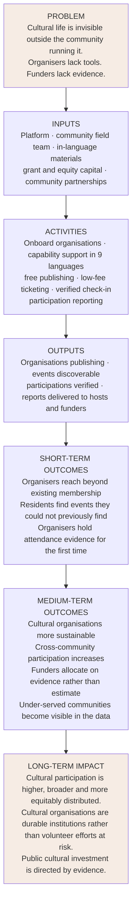

# CulturePass — Impact Measurement Framework

**Theory of change, logic model, and the KPI set used in every grant application, civic report and sponsor report.**
Owner: Data & Impact Analyst. Operational detail: process P14 in [`../02-strategy-framework/02-bpms.md`](../02-strategy-framework/02-bpms.md).

---

## 1. Theory of change

### The causal claims, and their weak links

Stated explicitly, because a theory of change that cannot be falsified is decoration.

| # | Claim | Evidence needed | Strength |
|---|---|---|---|
| 1 | If events are discoverable, more people attend | Attendance at events by hosts before vs after joining | **Testable in the pilot.** The core claim. |
| 2 | If organisers have attendance data, they win more funding | Host-reported funding outcomes at 12 months | **Weak — 12-month lag, and confounded.** Honest position: we can evidence that hosts *use* our reports in applications; attributing the funding outcome to us is a claim we should not make. |
| 3 | If discovery is cross-community, cross-cultural attendance rises | Attendance by participant community vs event community | Testable, and it is the social-cohesion claim funders care about most |
| 4 | If funders have participation data, allocation improves | Requires funder behaviour change over years | **Weakest link.** Not evidenceable within a 3-year horizon. Do not claim it in an acquittal. |
| 5 | If organisations are more sustainable, cultural life is richer | Long-horizon, multi-causal | Aspirational. State as intent, never as a measured outcome. |

**Claims 4 and 5 are aspirational and must be presented as such.** The discipline that matters: report what the data supports, flag what it does not, and never let a strong short-term result be used to imply a long-term one. Grant assessors and civic buyers read a great many impact reports and they notice the difference.

---

## 2. Logic model

| Inputs | Activities | Outputs | Outcomes | Impact |
|---|---|---|---|---|
| Platform (built) | Onboard organisations | Organisations active | Reach beyond existing membership | Higher cultural participation |
| Community field team | Capability support, 9 languages | Events published | Residents find events | Broader participation |
| Grant + equity capital | Free publishing | Verified participations | Organisers hold evidence | More equitable distribution |
| Community partnerships | Low-fee ticketing | Revenue to hosts | Organisations more sustainable | Durable cultural institutions |
| Cultural Advisory Council | Verified check-in | Reports to hosts | Cross-community attendance | Evidence-led public investment |
| | Participation reporting | Reports to funders | Under-served communities visible | |

---

## 3. The four KPI families

These four are what appears in every grant application, every civic dashboard and every sponsor report. Definitions are fixed here so that the same number means the same thing in every document.

### F1 — Community engagement

| Indicator | Definition | Source |
|---|---|---|
| Verified attendances | RSVP or ticket resulting in a confirmed gate check-in | Platform check-in |
| Estimated attendances | Host-reported attendance where check-in was not used | Host report — **always reported separately** |
| Attendances by cultural community | Verified attendances segmented by the event's community tag | Platform |
| Repeat participation rate | Share of participants attending 2+ events in 90 days | Platform |
| **New participants** | First-ever attendance on the platform | Platform |

### F2 — Cultural representation

| Indicator | Definition | Source |
|---|---|---|
| Distinct communities active | Cultural/linguistic communities with ≥1 active organisation and ≥1 published event | Platform taxonomy |
| First Nations organisations active | Count, reported only with the consent of those organisations | Platform + consent register |
| **Representation gap index** | Communities active on the platform relative to their share of local population | Platform + ABS census data |
| Languages of published content | Distinct languages in host-supplied event content | Platform |

The representation gap index is the metric no funder currently has and every one of them wants. It answers "who are we under-serving" with a number rather than an impression.

### F3 — Economic impact

| Indicator | Definition | Source |
|---|---|---|
| Gross revenue to hosts | GMV less platform fee, paid to host accounts | Platform transactions |
| Revenue to non-profit and small hosts | Same, filtered to organisations under a size threshold | Platform + host records |
| Pre-sale cash flow enabled | Ticket revenue received before event date | Platform |
| Local business offer redemptions | Coupon redemptions attributable to event attendance | Platform |

### F4 — Geographic dispersal

| Indicator | Definition | Source |
|---|---|---|
| Attendances by suburb | Verified attendances by event location | Platform |
| Share outside CBD | Percentage of attendances outside the central business district | Platform |
| Cross-suburb travel | Participants attending outside their home suburb | Platform — **aggregate only** |
| Suburb coverage | Suburbs with ≥1 published event in the period | Platform |

---

## 4. Data quality — the part that makes all of this either credible or worthless

| Rule | Why |
|---|---|
| **Verified and estimated attendance are never blended.** Verified means a gate check-in. Estimated means a host said so. Both are reported, always separately, with the method stated. | Blending them makes the entire dataset unusable and the company dishonest. This is the single most important rule in the framework. |
| Check-in rate is published alongside attendance figures | It is the data-trust proxy. An attendance number without its check-in rate is not interpretable. |
| **Internal threshold: 85% gate check-in on paid tickets before the civic dashboard is sold.** Below that, we tell the buyer to wait. | Selling a measurement product on weak data burns the market for years, for everyone. |
| Small-cell suppression: no reported cell below 5 | Re-identification risk in small communities is real |
| Every external release passes privacy review | P14 control |
| Individual-level data never leaves the platform | Absolute |
| Hosts see their own data before it appears in any external report | Fairness, and it catches errors |
| Baselines are zero and stated as such | Pre-launch. Do not imply history that does not exist. |

---

## 5. Reporting products

| Product | Audience | Frequency | Contents |
|---|---|---|---|
| **Post-event report** | Host | T+24h | Attendance, check-in rate, referral source, comparison to their own previous events |
| **Grant acquittal report** | Host, for their funder | On demand | Attendance, demographics where consented, revenue, event history — formatted for acquittal |
| **Civic participation dashboard** | Council / state body | Daily refresh | All four KPI families for their area, exportable |
| **Program impact report** | Grant funder | Per agreement | Milestone progress against the specific funded outcomes |
| **Sponsor performance report** | Sponsor | Monthly | Reach, verified attendance in their category, aggregate audience composition |
| **Annual impact report** | Public | Annual | Participation, communities represented, revenue generated for hosts, awards recipients, **and what we got wrong** |

The grant acquittal report is the highest-leverage product in this list. It serves the host, retains the host, and demonstrates the platform's value to funders and councils simultaneously — which is why it ships in H1 FY27 rather than later.

**The annual public impact report includes a section on what did not work.** An impact report with no failures in it is a marketing document, and the audiences that matter here can tell.

---

## 6. FY27 targets

| Family | Indicator | Target |
|---|---|---|
| F1 | Verified attendances | 96,000 |
| F1 | Check-in rate, paid tickets | ≥85% |
| F1 | Repeat participation within 90 days | ≥35% |
| F2 | Distinct cultural communities active | ≥45 |
| F2 | First Nations organisations active | ≥5 (relationship-led) |
| F2 | Languages of published content | ≥9 |
| F3 | Gross revenue to hosts | ≥A$750,000 |
| F3 | Share to non-profit / small hosts | ≥70% |
| F4 | Suburbs with ≥1 published event | ≥40 |
| F4 | Share of attendance outside CBD | ≥65% |
| — | Organisations publishing independently after support | ≥240 of 320 |
| — | Hosts who generated ≥1 acquittal report | ≥120 |

---

## 7. Evaluation approach

| Layer | Method | Timing |
|---|---|---|
| Output monitoring | Continuous platform data | Real time |
| Outcome measurement | Cohort analysis of host and participant behaviour | Quarterly |
| Host experience | Structured survey plus 20 interviews | Twice yearly |
| Participant experience | In-app survey, sampled | Quarterly |
| **Counterfactual** | Compare host attendance before and after joining, self-reported baseline | Annual |
| Independent evaluation | External evaluator, ideally university-partnered | End FY28 |

**On the counterfactual, honestly:** a before-and-after comparison against self-reported historical attendance is a weak design. It is confounded by seasonality, by host effort, and by the fact that hosts who join a new platform are not a random sample. It is what is affordable and available in year one, and it should be described that way in every report rather than presented as causal evidence.

The FY28 independent evaluation is where a defensible design becomes possible — ideally a staggered-onboarding comparison across suburbs, which the phased pilot rollout makes feasible almost by accident. **That is worth designing for deliberately now**, while the rollout sequence can still be structured to support it.
