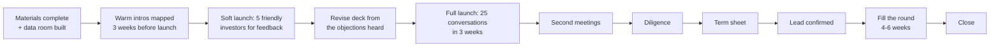

# CulturePass — Investor Pipeline & Process

**A$2.5M seed** · Owner: CEO · Target close: Q2 FY27 (Dec 2026 – Feb 2027)

---

## 1. Process design

A seed round is a sales process with a compressed timeline. The two failure modes are running it too slowly (momentum dies, and investors sense it) and running it before the materials are ready (you burn your best introductions on your worst pitch).

**The soft launch is not optional.** Five friendly investors will surface the three objections you have not prepared for, at zero cost. Hearing them for the first time in a meeting that mattered is an avoidable and expensive mistake.

---

## 2. Target profile, in priority order

| Tier | Profile | Why | What they will interrogate |
|---|---|---|---|
| **1** | AU pre-seed/seed funds with a marketplace thesis | Understand two-sided cold-start; will engage with the actual problem | Feed density, host retention, LTV construction |
| **1** | Impact and civic-tech funds | Value the measurement layer and public-sector revenue that generalists underweight | Theory of change, evidence quality, mission durability |
| **2** | Angels with arts, migration or local-government backgrounds | Bring doors money cannot buy. One angel with council relationships is worth more than the cheque. | Community credibility, founder authenticity |
| **2** | Angels who are technical founders | Will recognise what building this alone means | Architecture, technical decisions, hiring plan |
| **3** | Generalist AU seed funds | Fine, but expect the A$58M SAM to consume the entire meeting | TAM, exit paths |
| **4** | International seed funds | Only with a strong warm introduction. AU-only traction is a hard sell at seed. | Why this market, why now |

### Deliberately not approached at seed

- Growth-stage funds — wrong stage, and a pass from them creates a signalling problem for later
- Funds with a portfolio conflict in ticketing or events
- Anyone requiring a change to free-RSVP pricing, individual data sales, or the Cultural Advisory Council's binding authority. These are decided in advance precisely so they are not re-litigated inside a live negotiation.

---

## 3. Materials checklist

| Item | Status | Owner |
|---|---|---|
| Investor deck (10 slides + 10 appendix) | [`../05-pitch-deck/01-investor-deck.md`](../05-pitch-deck/01-investor-deck.md) ✅ | CEO |
| Presentable HTML/PDF deck | [`../05-pitch-deck/investor-deck.html`](../05-pitch-deck/investor-deck.html) ✅ | CEO |
| One-pager for intros | [`../05-pitch-deck/04-one-pager.md`](../05-pitch-deck/04-one-pager.md) ✅ | CEO |
| Financial model (driver-based, with sensitivities) | [`../01-business-plan/model/`](../01-business-plan/model/) ✅ | CEO |
| Business plan | [`../01-business-plan/02-business-plan.md`](../01-business-plan/02-business-plan.md) ✅ | CEO |
| Risk register | [`../01-business-plan/05-risk-register.md`](../01-business-plan/05-risk-register.md) ✅ | CEO |
| Data room | [`../08-appendix/data-room-checklist.md`](../08-appendix/data-room-checklist.md) ✅ | CEO |
| **Live product demo, rehearsed to 8 minutes** | ⬜ **Do this before launching** | CEO |
| Cap table and proposed post-round structure | ⬜ | CEO + lawyer |
| Founder background written up properly | ⬜ **Currently the thinnest part of the pack** | CEO |
| Company incorporated | ⬜ **Blocking** — see [`08-entity-and-foundation-strategy.md`](08-entity-and-foundation-strategy.md) | CEO + lawyer |

**Two blockers worth naming.** The company must be incorporated before a round can close. And the founder background section is currently the weakest element in the entire pack — investors and grant assessors both weight founder-market fit heavily, and "built the platform end to end" is necessary but not sufficient. Write it properly before the soft launch.

---

## 4. The demo — 8 minutes, rehearsed

The strongest asset available is that the product works. Most seed pitches are a deck; this one can be a working platform. Use it.

| Min | Show | Say |
|---|---|---|
| 0–1 | City feed, Melbourne, real event structure | "This is what a resident sees on Friday night" |
| 1–2 | Natural-language search: *"free Malayalam events this weekend"* | "That resolved to four structured filters. No competitor does this." |
| 2–3 | Community profile, follow, verified badge | "This is the community graph. It is the moat, and it cannot be scraped." |
| 3–4 | Event detail → RSVP → digital pass | "Free RSVP never touches a payment path. Free is architectural." |
| 4–5 | Gate check-in: scan, then scan the same pass again → rejected | "This rejection is why attendance data is trustworthy, and trustworthy data is what a council will pay for." |
| 5–6 | Host dashboard, event management | "This is what the organiser sees" |
| 6–7 | Admin console: platform KPIs, moderation queue, audit trail | "Governance is built, not planned" |
| 7–8 | The acquittal report concept | "This is the retention product. Once a host's funded application cites our data, they do not leave." |

**The duplicate-scan rejection at minute 5 is the moment of the demo.** It is small, concrete, and it makes the entire civic revenue thesis legible in four seconds. Rehearse it.

---

## 5. Pipeline tracker

| Stage | Definition | Target count | Conversion assumption |
|---|---|---|---|
| Identified | Researched, thesis fit confirmed | 60 | — |
| Warm intro secured | Named introducer committed | 35 | 58% |
| First meeting held | — | 25 | 71% |
| Second meeting | Real interest | 10 | 40% |
| Diligence | Model, references, data room | 5 | 50% |
| Term sheet | — | 2 | 40% |
| **Lead secured** | — | **1** | 50% |
| Round filled | Lead + 4–8 others | — | — |

**Sixty identified prospects to close one lead.** That ratio is normal and worth internalising in advance — a founder who expects 10 meetings to produce a term sheet interprets normal attrition as failure and loses momentum at exactly the wrong point.

Track for every prospect: firm, partner, thesis fit, introducer, stage, last contact, next action, next action date, objection raised, outcome.

**Log the objection every single time.** Three prospects raising the same objection means the deck is wrong, not that the prospects are wrong. That signal is the most valuable output of the first ten meetings.

---

## 6. Objection playbook

| Objection | Response |
|---|---|
| **"Market's too small for venture."** | A$58M is the Australian SAM, and the plan captures under 10% of it. Australia is the proving ground; the same structure exists in ~120 metros for a A$1.0–2.5B extension. We would rather show a defensible A$58M than an indefensible trillion. |
| **"Why hasn't Eventbrite done this?"** | Their fee structure cannot profitably serve a A$12 ticket and their taxonomy cannot express cultural community. A 40-person Onam sadya is not a customer they want. It is our entire market. |
| **"Two-sided marketplaces are brutal."** | Agreed, and it is the top risk in our register. Which is why supply comes first absolutely — 120 hosts and 300 events before any consumer spend — and why we concentrate on six suburbs rather than a city. |
| **"You're one person."** | Correct, and it is the highest-likelihood risk in the register. Senior engineer is hire #1, month 1. Architecture documented, infrastructure fully in CDK, code review from the second engineer's first week. |
| **"Grant income looks like a crutch."** | The business is EBITDA-negative with or without grants, and this round is sized without them. Grants buy CAC in the hardest-to-reach, highest-strategic-value supply — the part equity economics alone could never justify. |
| **"Civic sales cycles are 12+ months."** | Yes. Which is why civic revenue is A$0 in FY27 and A$180k in FY28. We are not asking you to underwrite it. It is the long-term enterprise value, not the near-term plan. |
| **"How do you defend Sydney?"** | We do not claim network effects protect us — cultural discovery is local. The defence is speed to community graph and civic contract per market, which is why we require an anchor partner before entering one. |
| **"Sponsorship is 38% of FY29 revenue."** | Correct, and it is the model's largest vulnerability — a 50% shortfall costs nearly twice what a paid-ticket collapse costs. Mitigation is four independent national partners, none above 15%, 18-month minimum terms, and a costed downside that runs without sponsorship at plan. |
| **"What's your exit?"** | Strategic acquisition by a ticketing or experience platform buying the community graph; a civic-tech acquirer buying the participation dashboard; or continued independence — the business is profitable and self-funding at A$13–15M platform revenue. |
| **"What kills this company?"** | A community trust breach, not competition. If we are ever seen as extracting from the communities we serve, the network that carries us destroys us. Which is why free stays free, individual data is never sold, and the Advisory Council is paid and binding. |

---

## 7. Diligence readiness

Expect requests for: the model with all assumptions exposed, the cap table, incorporation and IP assignment documents, the technical architecture, security and privacy posture, customer and partner references, the founder's background, and the risk register.

**Give them the risk register unprompted.** Handing over an honest, owned, scored register with named triggers is unusual at seed and it reframes every subsequent conversation — it signals that you have already found the problems they were hoping to discover.

**The two things to disclose before being asked:** there is no revenue and no signed anything; and the payments compliance work (trust accounting for held ticket funds) is a pre-launch blocker that is scheduled but not yet complete. Both will surface in diligence. Surfacing them yourself costs nothing; having them surfaced for you costs credibility on everything else.
